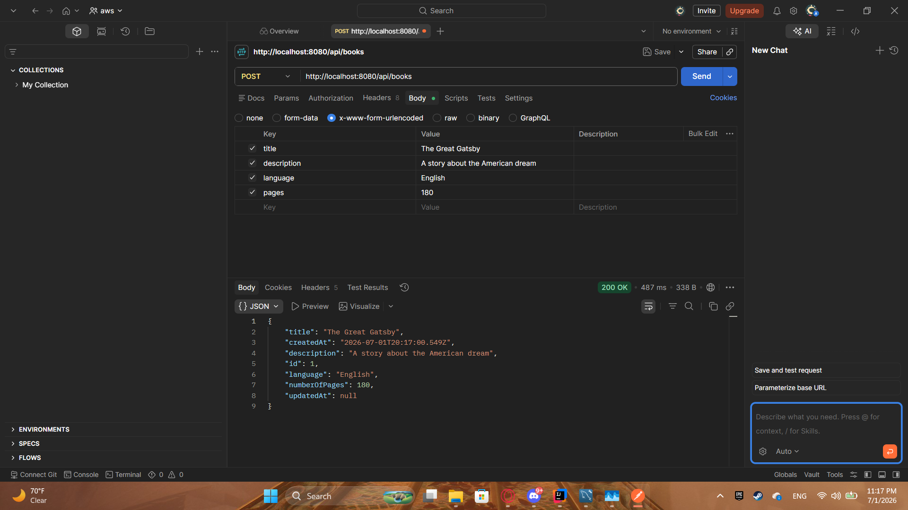
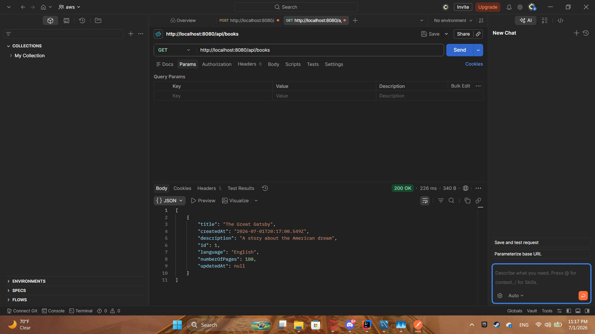
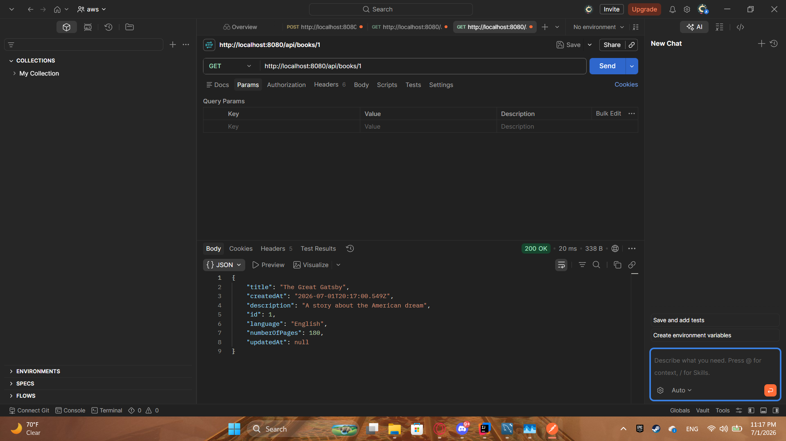
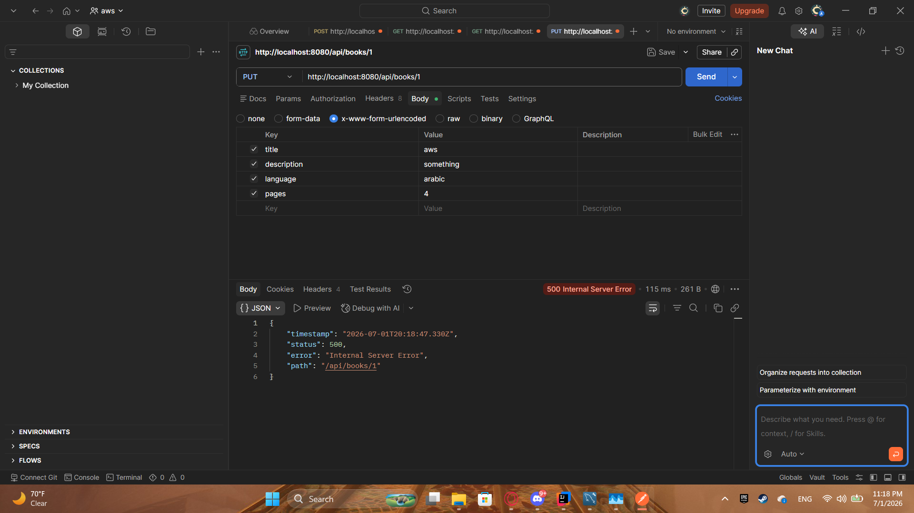
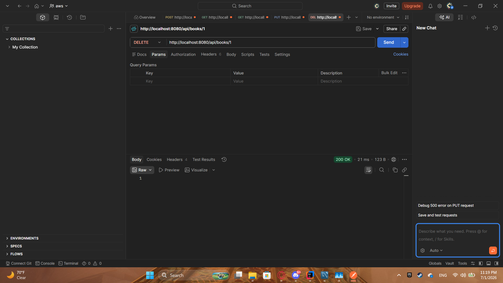

# Book API

## Preview
### POST - Create a Book

### GET - All Books

### GET - Single Book

### PUT - Update a Book

### DELETE - Delete a Book


## Run the app
```
# 1. navigate to the project folder
cd Desktop\axsos\Java\spring boot\bookapi

# 2. build and run the Spring Boot app
./mvnw spring-boot:run
```
Then test the API at: `http://localhost:8080/api/books`

## Built With
- [Java](https://www.java.com/) — programming language
- [Spring Boot](https://spring.io/projects/spring-boot) — Java web framework
- [Spring Data JPA](https://spring.io/projects/spring-data-jpa) — database ORM layer
- [Postman](https://www.postman.com/) — API testing tool

## Features
- Retrieve all books with a GET request to `/api/books`
- Retrieve a single book by ID with a GET request to `/api/books/{id}`
- Create a new book with a POST request to `/api/books`
- Update an existing book by ID with a PUT request to `/api/books/{id}`
- Delete a book by ID with a DELETE request to `/api/books/{id}`
- Automatically track creation and update timestamps on each book