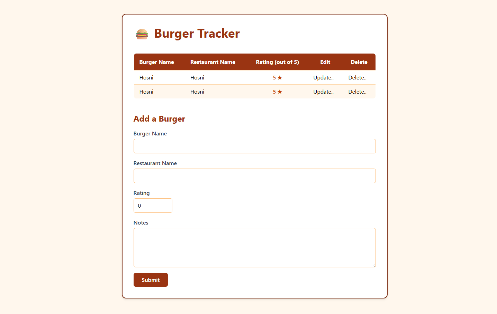
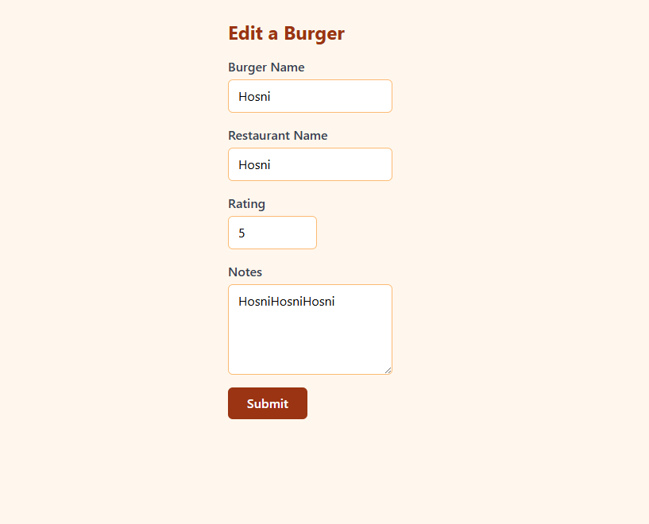

# Burger Tracker

## Preview
### Home Page

### Edit Page


## Run the app
```
# 1. navigate to the project folder
cd Desktop\axsos\Java\spring boot\burgertruker

# 2. build and run the Spring Boot app
./mvnw spring-boot:run
```
Then open your browser at: `http://localhost:8080`

## Built With
- [Java](https://www.java.com/) — programming language
- [Spring Boot](https://spring.io/projects/spring-boot) — Java web framework
- [Spring Data JPA](https://spring.io/projects/spring-data-jpa) — database ORM layer
- [JSP](https://www.oracle.com/java/technologies/jspt.html) — Java Server Pages for HTML templating

## Features
- Display all tracked burgers in a table with name, restaurant, and rating
- Add a new burger with name, restaurant name, rating, and notes via a form
- Edit an existing burger's details on a dedicated update page
- Delete a burger directly from the table
- Validate all form inputs and show error messages for invalid entries
- Automatically track creation and update timestamps on each burger