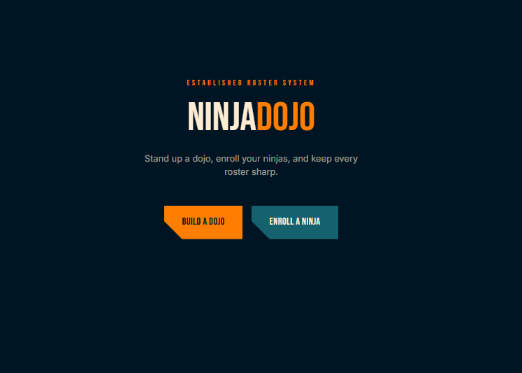
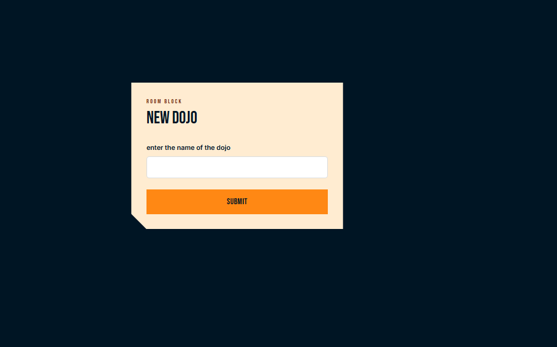
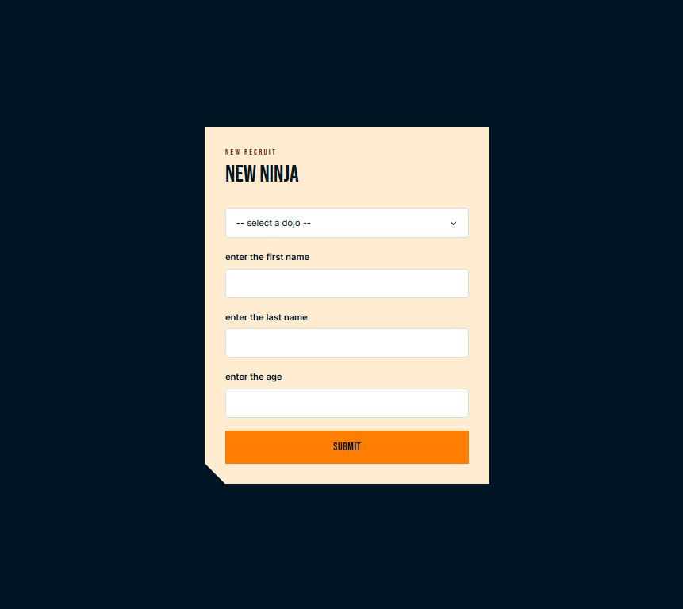
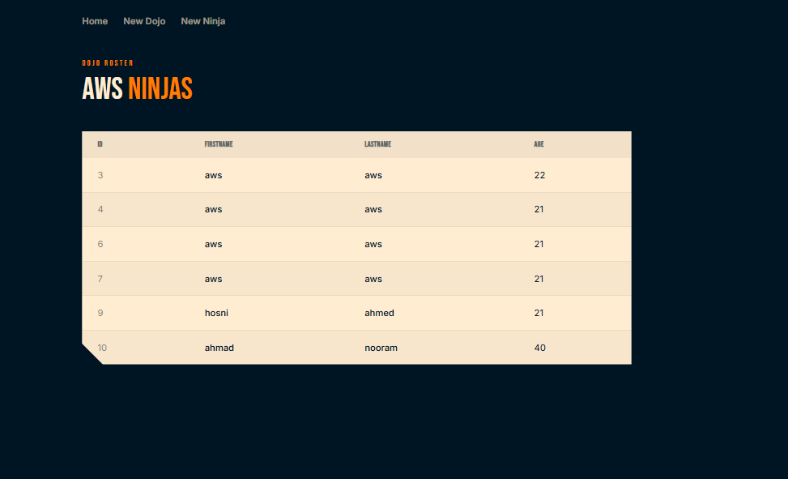

# Ninja Dojo

## Preview
### Review
[▶ Watch the review](https://drive.google.com/file/d/1_tV4gj0iAn6KQvDxNDM8e2SsU35WALNz/view?usp=drive_link)
### Landing Page

### New Dojo Page

### New Ninja Page

### Dojo Roster Page


## Run the app
```
# 1. navigate to the project folder
cd Desktop\axsos\Java\spring boot\ninjadojo

# 2. build and run the Spring Boot app
./mvnw spring-boot:run
```
Then open your browser at: `http://localhost:8080`

## Built With
- [Java](https://www.java.com/) — programming language
- [Spring Boot](https://spring.io/projects/spring-boot) — Java web framework
- [Spring Data JPA](https://spring.io/projects/spring-data-jpa) — database ORM layer
- [JSP](https://www.oracle.com/java/technologies/jspt.html) — Java Server Pages for HTML templating

## Features
- Display a landing page with navigation to create a dojo or enroll a ninja
- Create a new dojo with a name via a dedicated form
- Enroll a new ninja with first name, last name, and age and assign them to a dojo
- View all ninjas in a dojo on a roster table showing ID, first name, last name, and age
- One-to-many relationship between Dojos and Ninjas
- Validate all form inputs and show error messages for invalid entries