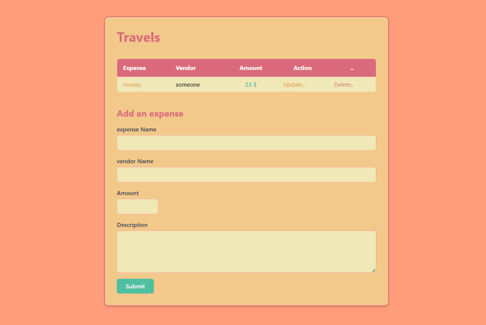
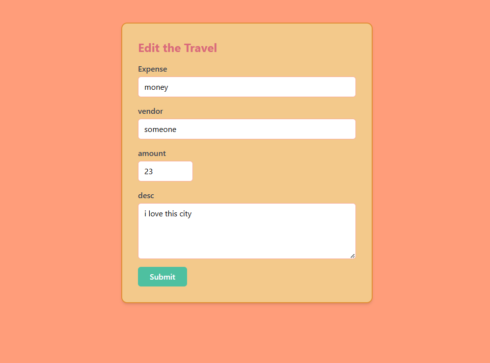
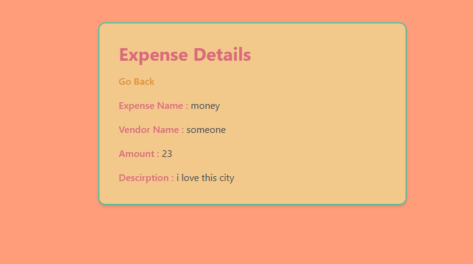

# Save Travels

## Preview
### Landing Page

### Travels Page

### Edit Page

### Expense Details Page


## Run the app
```
# 1. navigate to the project folder
cd Desktop\axsos\Java\spring boot\savetravels

# 2. build and run the Spring Boot app
./mvnw spring-boot:run
```
Then open your browser at: `http://localhost:8080`

## Built With
- [Java](https://www.java.com/) — programming language
- [Spring Boot](https://spring.io/projects/spring-boot) — Java web framework
- [Spring Data JPA](https://spring.io/projects/spring-data-jpa) — database ORM layer
- [JSP](https://www.oracle.com/java/technologies/jspt.html) — Java Server Pages for HTML templating

## Features
- Display a landing page with a button to navigate to the travels tracker
- View all travel expenses in a table with expense name, vendor, and amount
- Add a new travel expense with name, vendor, amount, and description via a form
- View the full details of a single expense on a dedicated show page
- Edit an existing travel expense on a dedicated update page
- Delete a travel expense directly from the table
- Validate all form inputs and show error messages for invalid entries