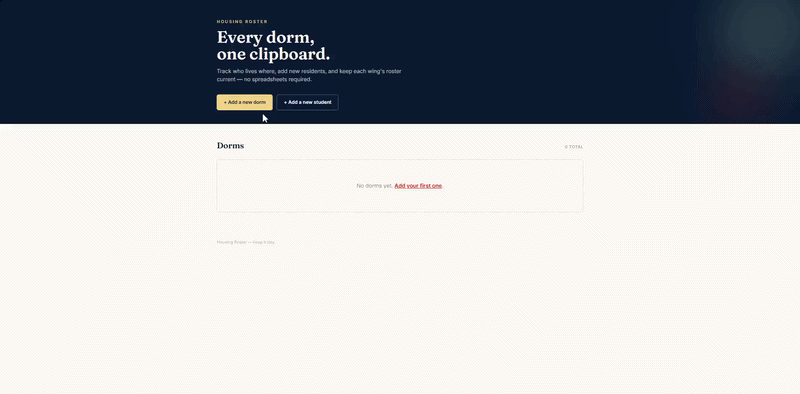
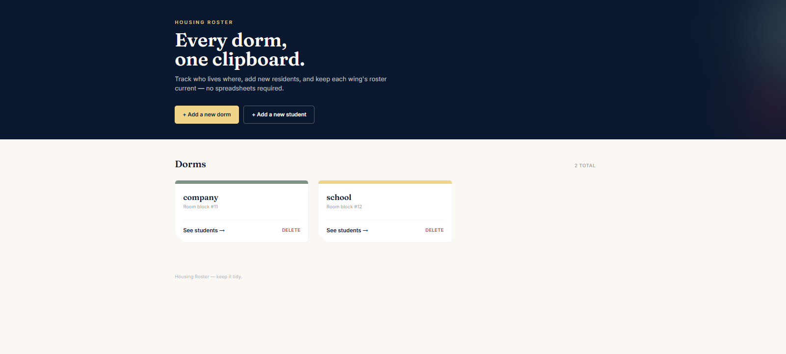
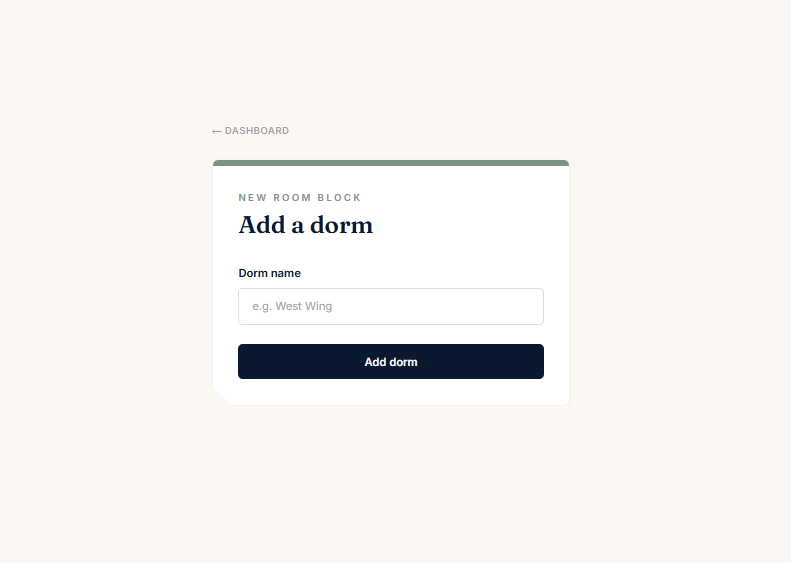
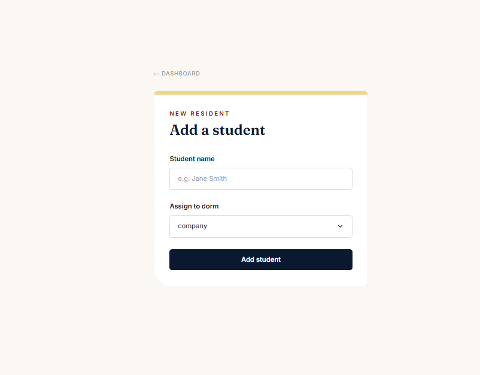
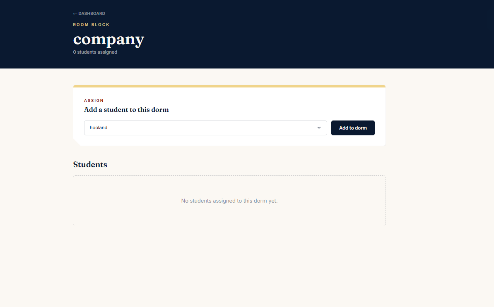

# Student Roster

## Preview

### Review

### Dashboard

### Add a Dorm Page

### Add a Student Page

### Dorm Details Page


## Run the app
```
# 1. navigate to the project folder
cd Desktop\axsos\Java\spring boot\studentrostar

# 2. build and run the Spring Boot app
./mvnw spring-boot:run
```
Then open your browser at: `http://localhost:8080/dorms`

## Built With
- [Java](https://www.java.com/) — programming language
- [Spring Boot](https://spring.io/projects/spring-boot) — Java web framework
- [Spring Data JPA](https://spring.io/projects/spring-data-jpa) — database ORM layer
- [JSP](https://www.oracle.com/java/technologies/jspt.html) — Java Server Pages for HTML templating

## Features
- Display all dorms on a dashboard with the total count
- Add a new dorm with a name via a dedicated form
- Delete a dorm directly from the dashboard
- View a dorm's detail page showing all assigned students
- Add a new student and assign them to a dorm via a dropdown
- Assign an existing student to a dorm from the dorm detail page
- Remove a student from a dorm
- One-to-many relationship between Dorms and Students