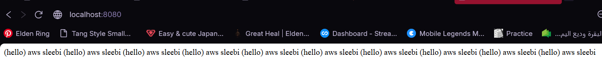

# Hello Human

## Preview
### Home Page


## Run the app
```
# 1. navigate to the project folder
cd Desktop\axsos\Java\spring boot\hellohuman

# 2. build and run the Spring Boot app
./mvnw spring-boot:run
```
Then open your browser at: `http://localhost:8080`

## Built With
- [Java](https://www.java.com/) — programming language
- [Spring Boot](https://spring.io/projects/spring-boot) — Java web framework

## Features
- Display a default greeting of "hello human" when no name is provided in the URL
- Accept a `name` query parameter to personalize the greeting
- Accept a `last_name` query parameter to include the visitor's last name
- Accept a `time` query parameter to repeat the greeting any number of times on the page