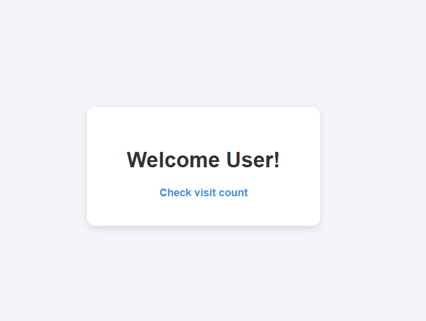
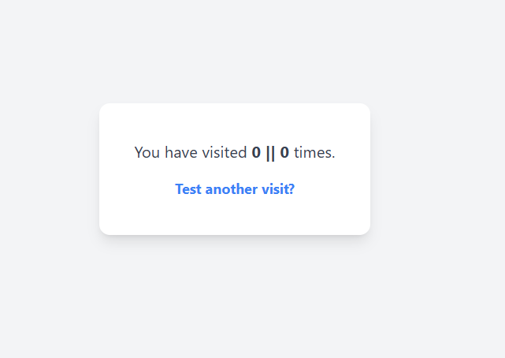

# Counter

## Preview
### Home Page

### Counter Page


## Run the app
```
# 1. navigate to the project folder
cd Desktop\axsos\Java\spring boot\counter

# 2. build and run the Spring Boot app
./mvnw spring-boot:run
```
Then open your browser at: `http://localhost:8080`

## Built With
- [Java](https://www.java.com/) — programming language
- [Spring Boot](https://spring.io/projects/spring-boot) — Java web framework
- [JSP](https://www.oracle.com/java/technologies/jspt.html) — Java Server Pages for HTML templating

## Features
- Display a welcome page and increment a visit counter on each page load
- Show the current number of visits at `/counter`
- Navigate between the home page and the counter page to test the visit count