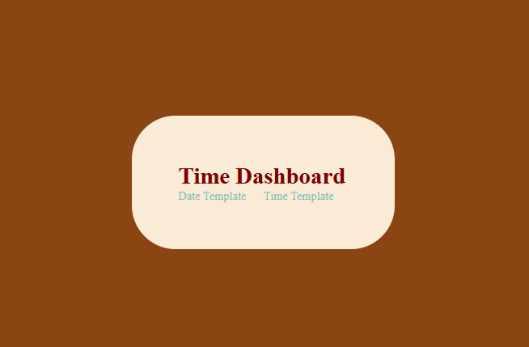
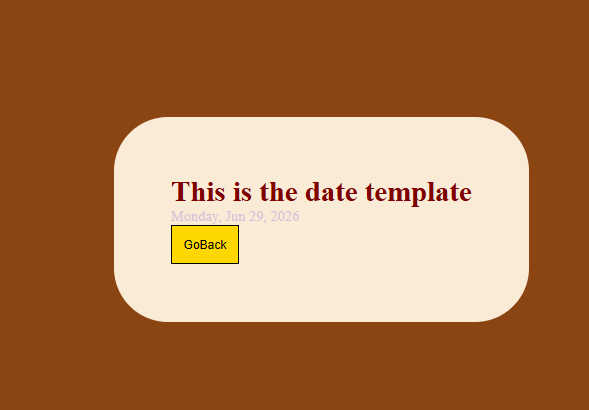
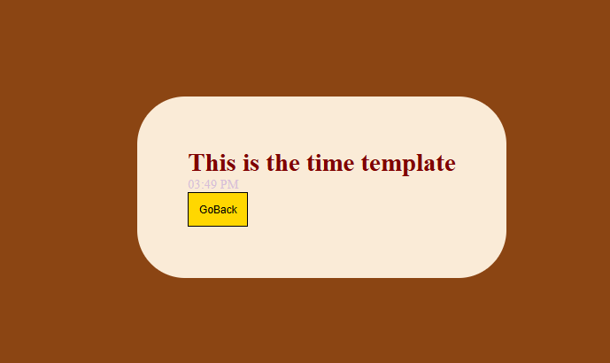

# Time Dashboard

## Preview
### Home Page

### Date Page

### Time Page


## Run the app
```
# 1. navigate to the project folder
cd Desktop\axsos\Java\spring boot\display

# 2. build and run the Spring Boot app
./mvnw spring-boot:run
```
Then open your browser at: `http://localhost:8080`

## Built With
- [Java](https://www.java.com/) — programming language
- [Spring Boot](https://spring.io/projects/spring-boot) — Java web framework
- [JSP](https://www.oracle.com/java/technologies/jspt.html) — Java Server Pages for HTML templating

## Features
- Display a home dashboard with navigation links to the date and time pages
- Show the current date formatted as day, month, and year at `/date`
- Show the current time formatted as hours and minutes at `/time`
- Navigate back to the home page from both the date and time pages