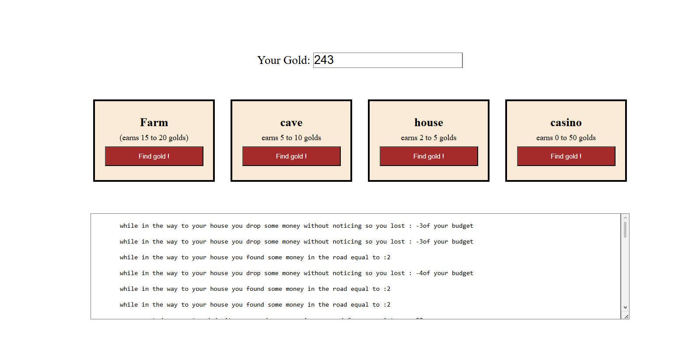

# Ninja Gold

## Preview

## Home Page

## Run the app

# 1. navigate to the project folder
cd path\to\project\ninja-gold

# 2. build and run the Spring Boot app
./mvnw spring-boot:run

Then open your browser at: `http://localhost:8080/`

## Built With
- [Java](https://www.java.com) — programming language
- [Spring Boot](https://spring.io/projects/spring-boot) — Java web framework
- [JSP](https://en.wikipedia.org/wiki/JavaServer_Pages) — Java Server Pages for HTML templating
- [JSTL](https://jakarta.ee/specifications/tags/) — used for looping through the earnings history (`<c:forEach>`)

## Features
- Displays current gold total, stored in the user's session
- Four locations (Farm, Cave, House, Casino) each with different earn/lose ranges
- Random gain or loss calculated per visit, added to session total
- Message history of every visit shown in a scrollable textarea
- Gold amount and history persist across requests via `HttpSession`