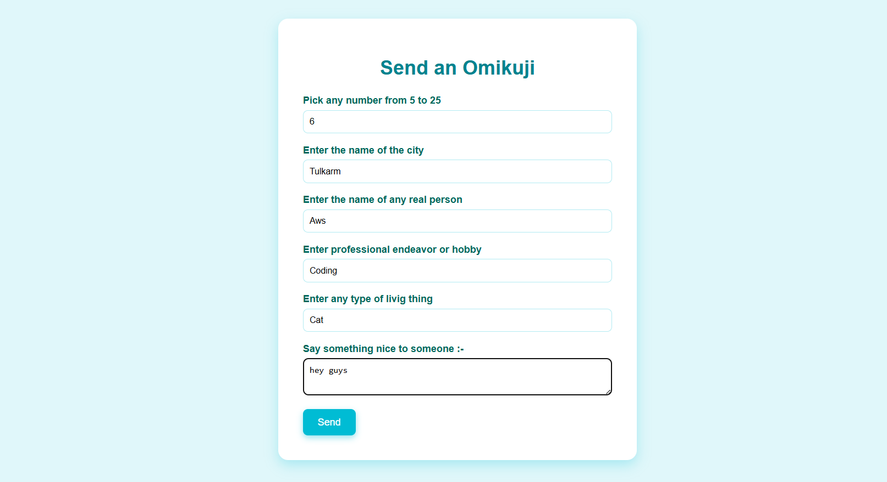
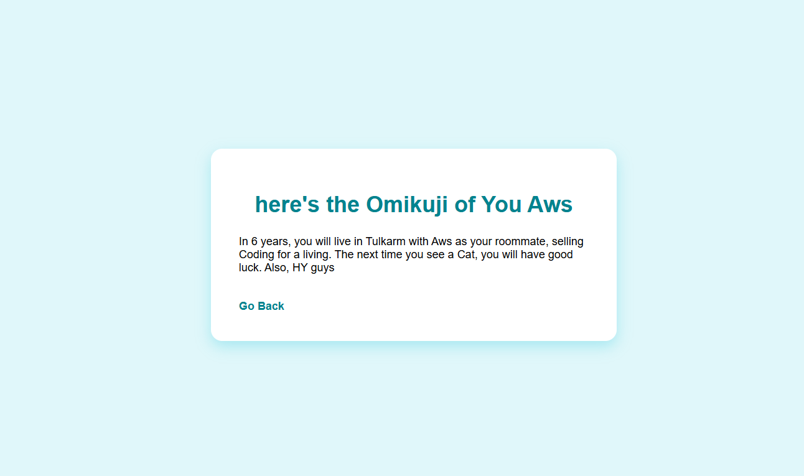

# Omikuji

## Preview
### Home Page

### Fortune Page


## Run the app
```
# 1. navigate to the project folder
cd Desktop\axsos\Java\spring boot\java spring basics\omikiji

# 2. build and run the Spring Boot app
./mvnw spring-boot:run
```
Then open your browser at: `http://localhost:8080/omikuji`

## Built With
- [Java](https://www.java.com/) — programming language
- [Spring Boot](https://spring.io/projects/spring-boot) — Java web framework
- [JSP](https://www.oracle.com/java/technologies/jspt.html) — Java Server Pages for HTML templating

## Features
- Display a form to collect a number, city, name, hobby, living thing, and a personal message
- Submit form data via POST and store it in the user's session
- Generate and display a personalized fortune using the submitted data
- Navigate back to the form to submit a new entry