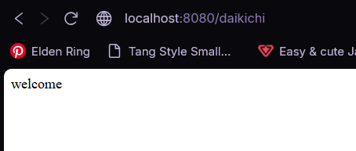
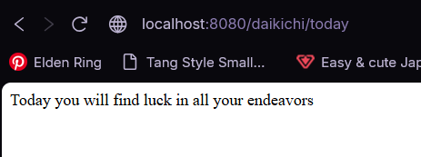

# Path Variables

## Preview
### Welcome Page

### Today Page

### Tomorrow Page


## Run the app
```
# 1. navigate to the project folder
cd Desktop\axsos\Java\spring boot\pathvariables

# 2. build and run the Spring Boot app
./mvnw spring-boot:run
```
Then open your browser at: `http://localhost:8080/daikichi`

## Built With
- [Java](https://www.java.com/) — programming language
- [Spring Boot](https://spring.io/projects/spring-boot) — Java web framework

## Features
- Return a welcome message at `/daikichi`
- Return a today fortune message at `/daikichi/today`
- Return a tomorrow fortune message at `/daikichi/tomorrow`
- Accept a city name as a path variable at `/daikichi/travel/{name}` and return a personalized travel message
- Accept a number as a path variable at `/daikichi/lotto/{num}` and return a different fortune based on whether the number is even or odd