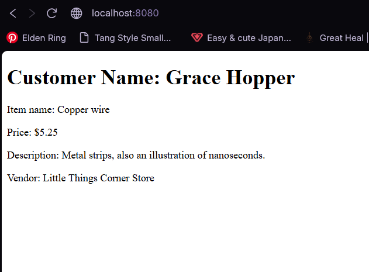

# Simple Recipet

## Preview
### Home Page


## Run the app
```
# 1. navigate to the project folder
cd Desktop\axsos\Java\spring boot\java spring basics\simple recipet\recipet

# 2. build and run the Spring Boot app
./mvnw spring-boot:run
```
Then open your browser at: `http://localhost:8080`

## Built With
- [Java](https://www.java.com/) — programming language
- [Spring Boot](https://spring.io/projects/spring-boot) — Java web framework
- [JSP](https://www.oracle.com/java/technologies/jspt.html) — Java Server Pages for HTML templating

## Features
- Set up a Spring Boot MVC controller using the Model interface
- Pass customer name, item name, price, description, and vendor as model attributes
- Render all data dynamically on a JSP view template