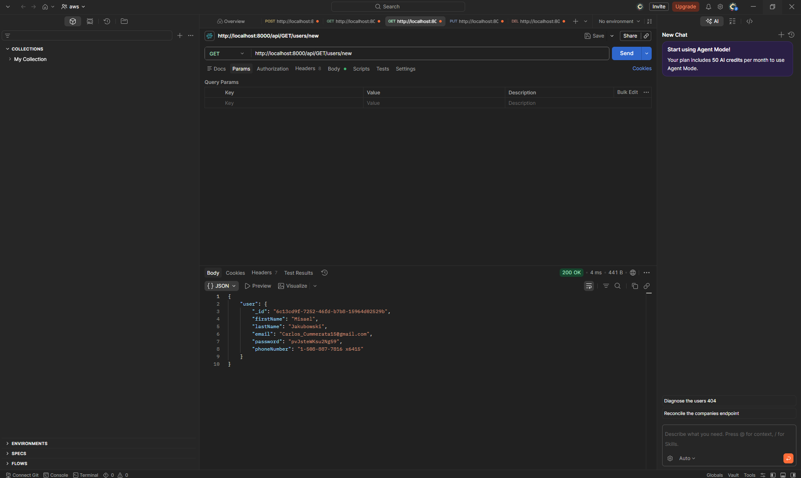
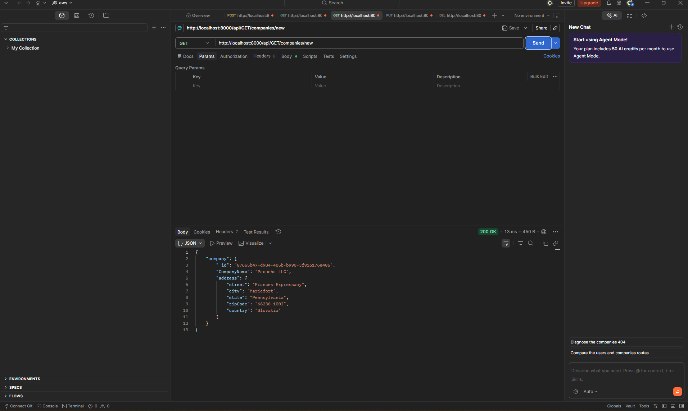
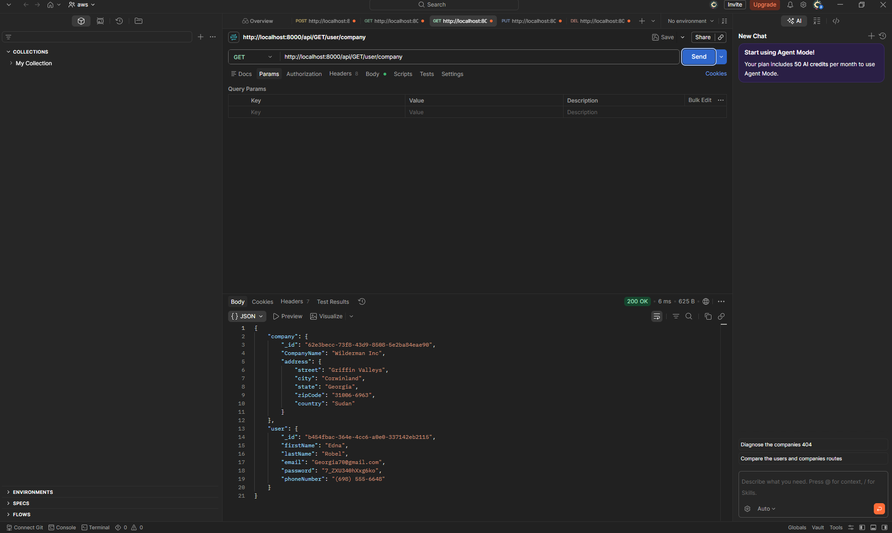

# Faker API

## Preview

### GET - New User



### GET - New Company



### GET - User and Company



## Run the app

```
# 1. install dependencies
npm install

# 2. start the server
node server.js
```

Then test the API at: `http://localhost:8000`

## Built With

- [Node.js](https://nodejs.org/) — JavaScript runtime
- [Express](https://expressjs.com/) — web framework
- [Faker.js](https://fakerjs.dev/) — fake data generator
- [Postman](https://www.postman.com/) — API testing tool

## Features

- Generate a random user with first name, last name, email, password, and phone number at `/api/GET/users/new`
- Generate a random company with name and full address at `/api/GET/companies/new`
- Generate a random user and company together at `/api/GET/user/company`
