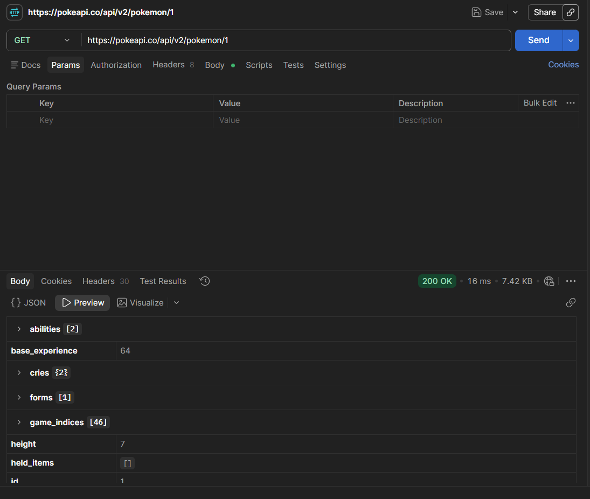
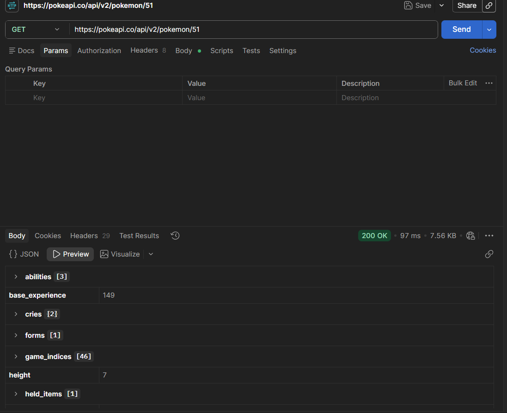
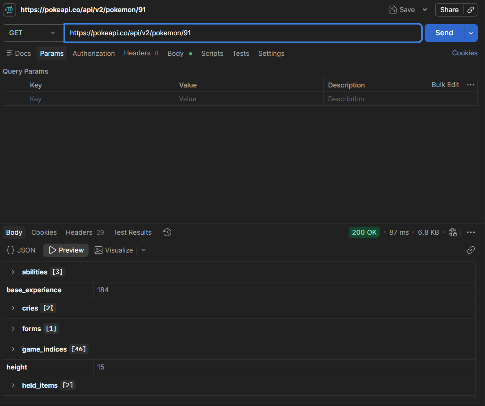
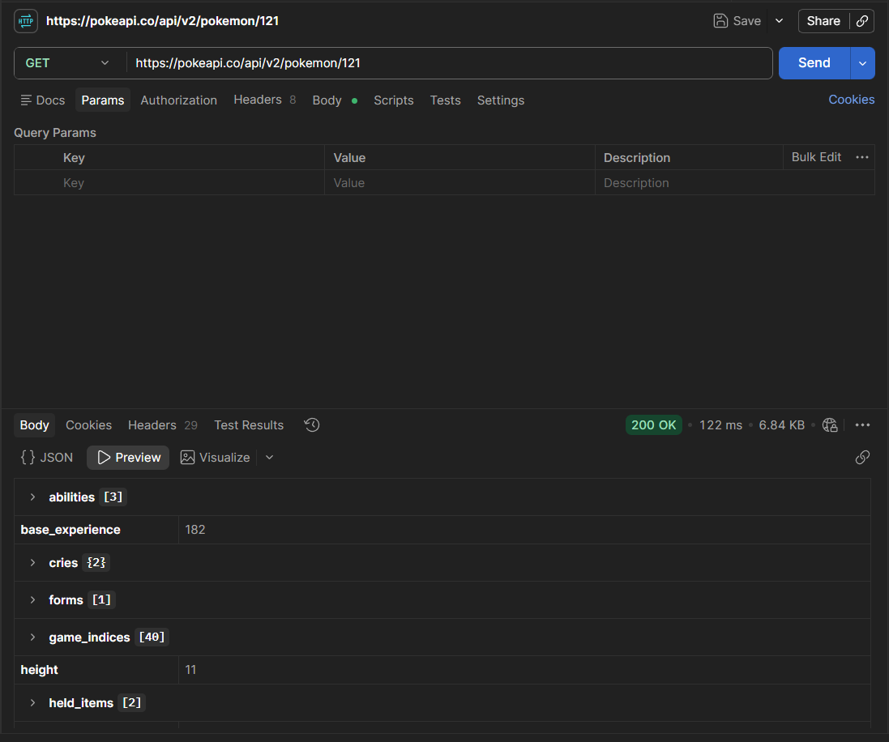
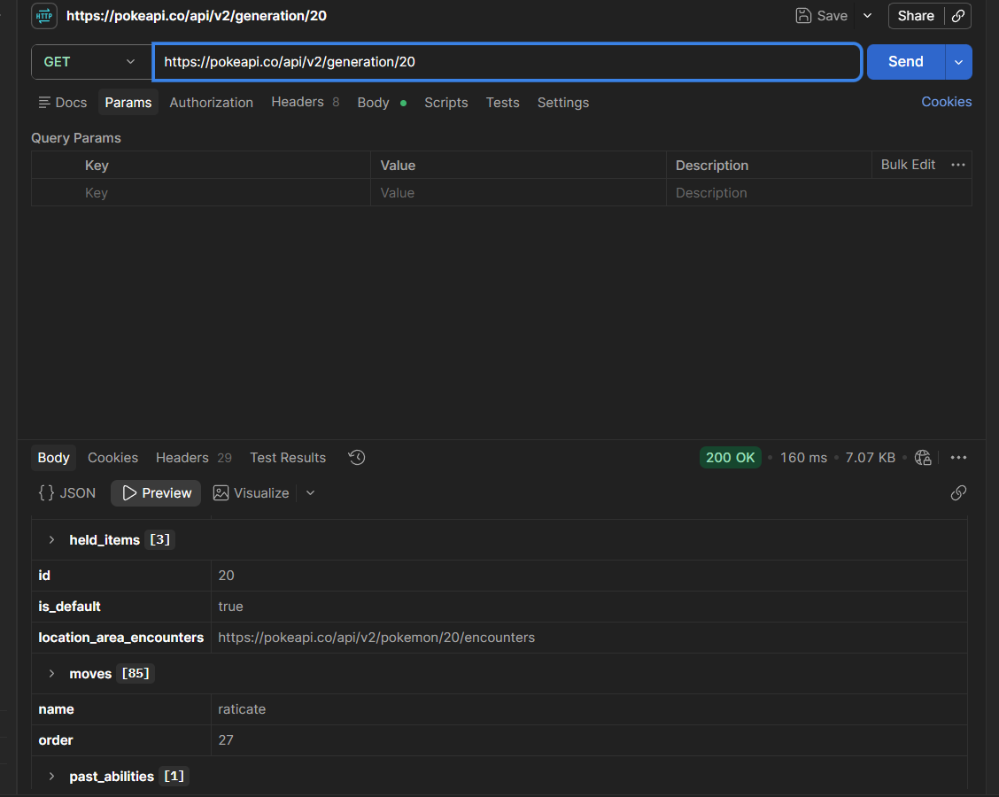

# PokéAPI Exploration

## Preview

### GET - Pokémon #1



### GET - Pokémon #51



### GET - Pokémon #91



### GET - Pokémon #121



### GET - Generation #20



## Run the app

No setup required. Test the API directly using Postman at:

```
https://pokeapi.co/api/v2/pokemon/{id}
https://pokeapi.co/api/v2/generation/{id}
```

## Built With

- [PokéAPI](https://pokeapi.co/) — public Pokémon REST API
- [Postman](https://www.postman.com/) — API testing tool

## Features

- Fetch detailed data for individual Pokémon by ID from the PokéAPI
- Explore Pokémon attributes including abilities, base experience, height, held items, moves, and game indices
- Fetch generation data by ID including held items and Pokémon names
