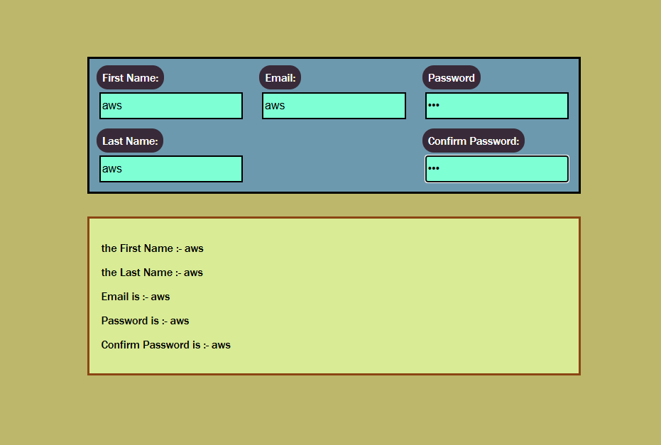

# Registration Form

## Preview

### Home Page



## Run the app

```
# 1. install dependencies
npm install

# 2. run the development server
npm run dev
```

Then open your browser at: `http://localhost:5173`

## Built With

- [React](https://react.dev/) — JavaScript UI library
- [Vite](https://vitejs.dev/) — frontend build tool

## Features

- Build a controlled registration form using `useState` for each input field
- Track first name, last name, email, password, and confirm password in real time
- Display all entered field values live below the form as the user types
