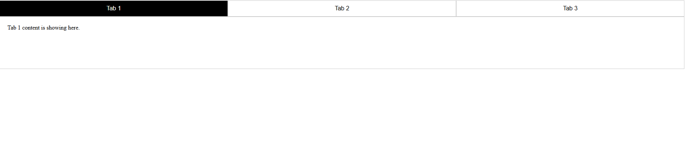

# Tabs

## Preview



## Run the app

```
# 1. install dependencies
npm install

# 2. run the development server
npm run dev
```

Then open your browser at: `http://localhost:5173`

## Built With

- [React](https://react.dev/) — JavaScript UI library
- [Vite](https://vitejs.dev/) — frontend build tool

## Features

- Build a reusable `Tabs` component that accepts a `tabs` prop containing labels and content
- Track the active tab using `useState`
- Highlight the active tab with a CSS class
- Render only the content of the currently selected tab
