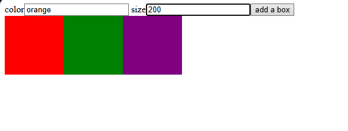
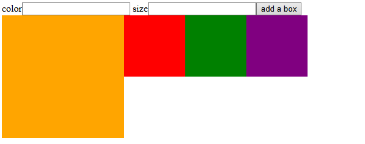

# Color Box

## Preview
### Home Page

### Orange Box Example


## Run the app
```
# 1. install dependencies
npm install

# 2. run the development server
npm run dev
```
Then open your browser at: `http://localhost:5173`

## Built With
- [React](https://react.dev/) — JavaScript UI library
- [Vite](https://vitejs.dev/) — frontend build tool

## Features
- Enter a color name and size in a form and submit to add a new colored box
- Lift state up from `Form` to `Box` using a callback prop `onAddBox`
- New boxes are prepended to the front of the list
- Dynamically render each box with inline styles for background color, width, and height
- Clear the input fields after each submission