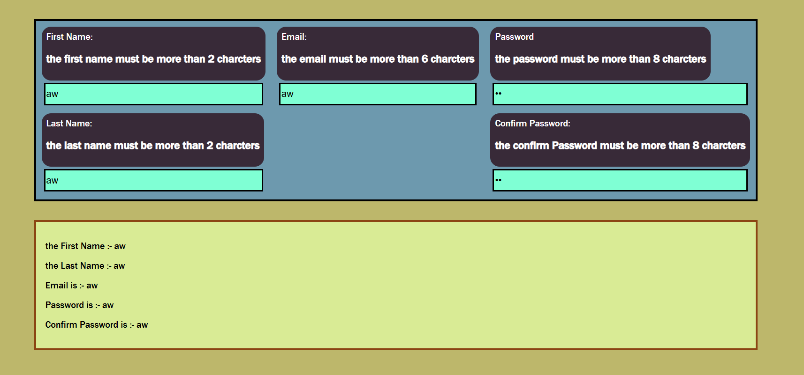

# Registration Form With Validation

## Preview
### Home Page


## Run the app
```
# 1. install dependencies
npm install

# 2. run the development server
npm run dev
```
Then open your browser at: `http://localhost:5173`

## Built With
- [React](https://react.dev/) — JavaScript UI library
- [Vite](https://vitejs.dev/) — frontend build tool

## Features
- Manage all form fields in a single state object using the spread operator
- Track validation errors in a separate errors state object
- Show inline error messages under each field when input is too short
- Validate first name and last name for a minimum of 3 characters
- Validate email for a minimum of 6 characters
- Validate password and confirm password for a minimum of 8 characters
- Clear error messages automatically when the field is empty or valid
- Display all entered values live below the form as the user types