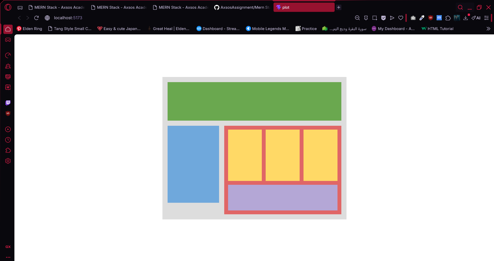

# Plot

## Preview

### Home Page



## Run the app

```
# 1. install dependencies
npm install

# 2. run the development server
npm run dev
```

Then open your browser at: `http://localhost:5173`

## Built With

- [React](https://react.dev/) — JavaScript UI library
- [Vite](https://vitejs.dev/) — frontend build tool

## Features

- Build a component-based page layout using CSS Modules for scoped styling
- Render a `Header` component as the top green bar
- Render a `Navigation` component as the left blue section
- Render a `Main` component that wraps child components
- Display three `SubContents` components as yellow boxes inside Main
- Display an `Advertisement` component as the purple bottom section inside Main
