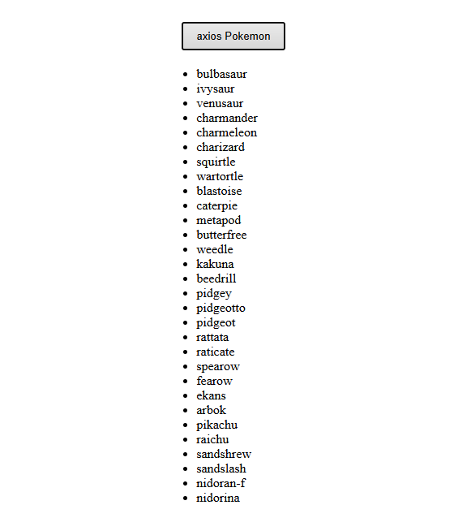

# Axios Pokemon

## Preview

### Home Page



## Run the app

```
# 1. install dependencies
npm install

# 2. run the development server
npm run dev
```

Then open your browser at: `http://localhost:5173`

## Built With

- [React](https://react.dev/) — JavaScript UI library
- [Vite](https://vitejs.dev/) — frontend build tool
- [Axios](https://axios-http.com/) — HTTP client for API requests
- [PokéAPI](https://pokeapi.co/) — public Pokémon REST API

## Features

- Fetch a list of 807 Pokémon from the PokéAPI on button click using Axios
- Store the fetched results in state using `useState`
- Display all Pokémon names in a list after the data is loaded
- Handle fetch errors gracefully with a try/catch block
