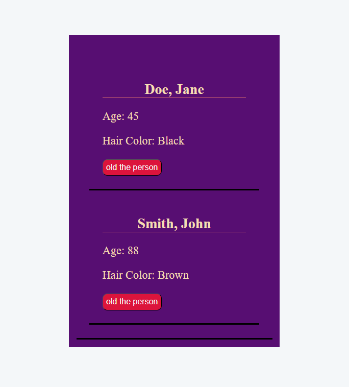

# Stateful Person Card

## Preview
### Home Page


## Run the app
```
# 1. install dependencies
npm install

# 2. run the development server
npm run dev
```
Then open your browser at: `http://localhost:5173`

## Built With
- [React](https://react.dev/) — JavaScript UI library
- [Vite](https://vitejs.dev/) — frontend build tool

## Features
- Display person cards with first name, last name, age, and hair color using props
- Track each person's age independently using `useState`
- Increment a person's age by 1 on each button click
- Show an alert and reset the age back to the default value if the age reaches 90 or above