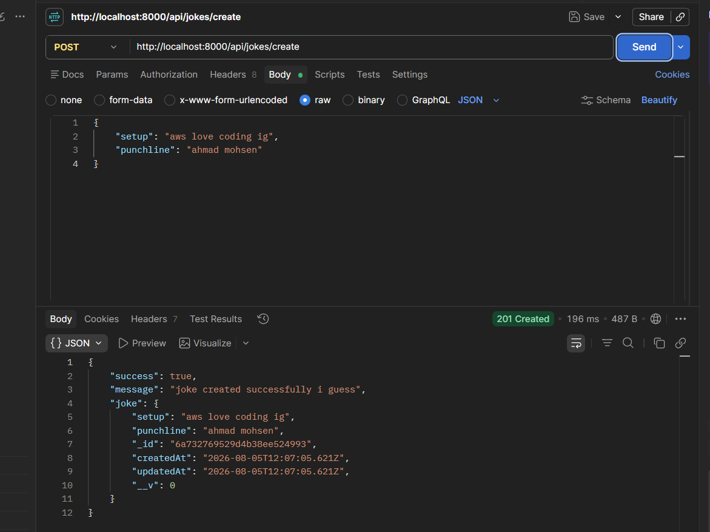
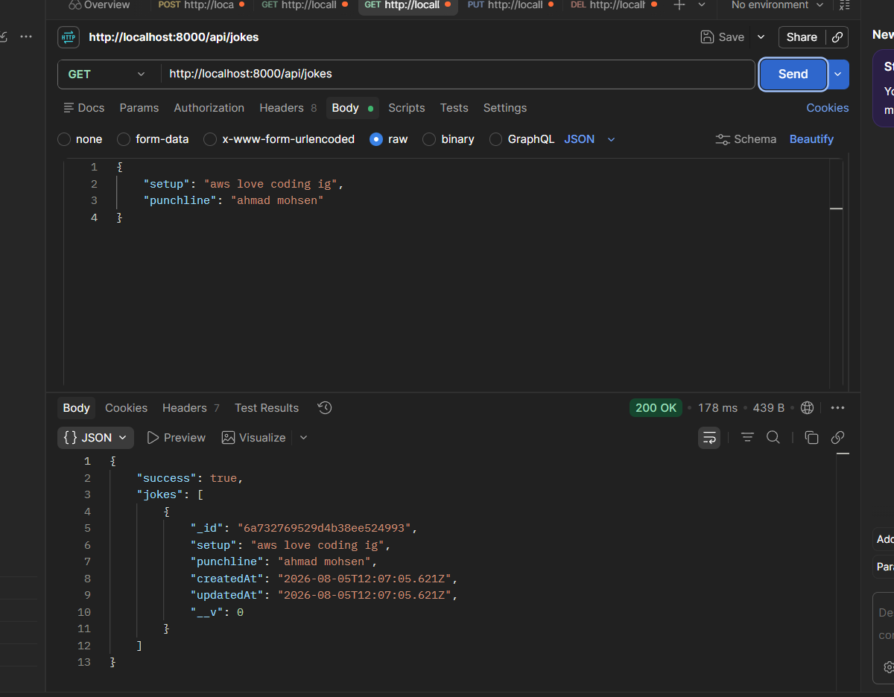
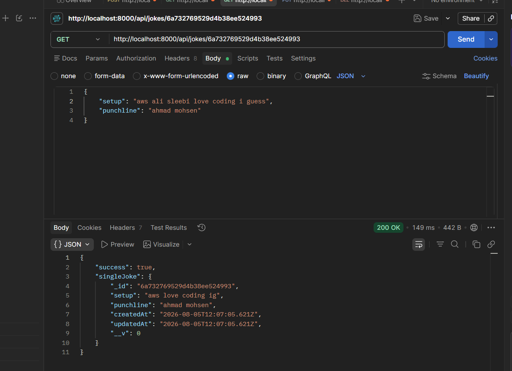
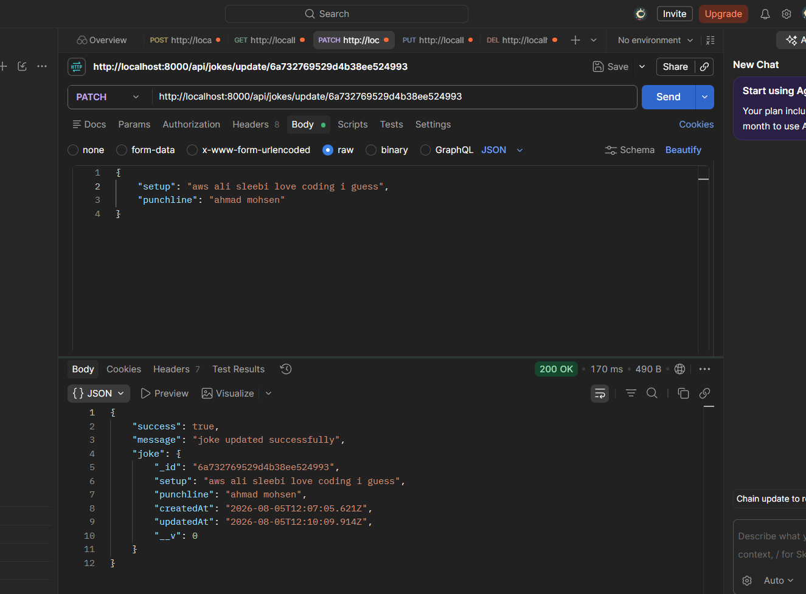
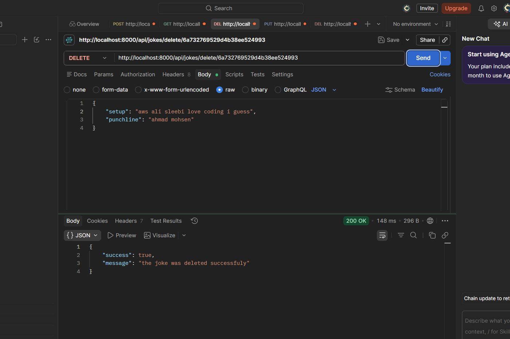

# Jokes API

## Preview

### POST - Create a Joke



### GET - All Jokes



### GET - Single Joke



### PATCH - Update a Joke



### DELETE - Delete a Joke



## Run the app

```
# 1. install dependencies
npm install

# 2. start the server
node server.js
```

Then test the API at: `http://localhost:8000`

## Built With

- [Node.js](https://nodejs.org/) — JavaScript runtime
- [Express](https://expressjs.com/) — web framework
- [MongoDB](https://www.mongodb.com/) — NoSQL database
- [Mongoose](https://mongoosejs.com/) — MongoDB object modeling
- [Postman](https://www.postman.com/) — API testing tool

## Features

- Retrieve all jokes via GET request to `/api/jokes`
- Retrieve a single joke by ID via GET request to `/api/jokes/:id`
- Create a new joke with setup and punchline via POST request to `/api/jokes/create`
- Update an existing joke by ID via PATCH request to `/api/jokes/update/:id`
- Delete a joke by ID via DELETE request to `/api/jokes/delete/:id`
- Validate setup and punchline with minimum length requirements using Mongoose schema
- Automatically track creation and update timestamps on each joke
