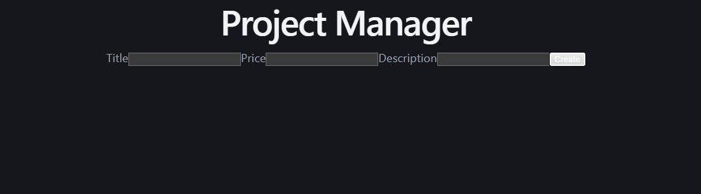
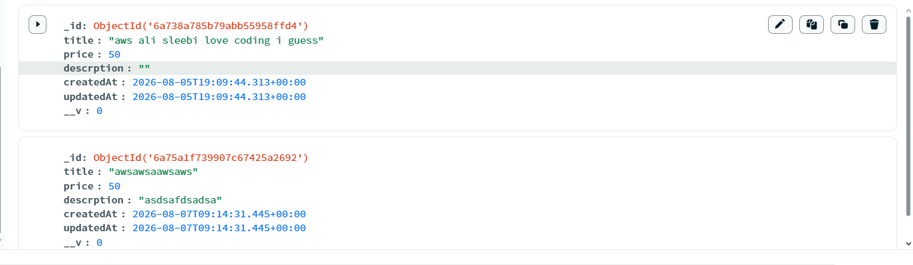

# Project Manager

## Preview

### Home Page



### MongoDB Data



## Run the app

```
# 1. start the backend server
cd server
npm install
node server.js

# 2. in a new terminal, start the React frontend
cd project-manegar
npm install
npm run dev
```

Then open your browser at: `http://localhost:5173`

## Built With

- [React](https://react.dev/) — JavaScript UI library
- [Vite](https://vitejs.dev/) — frontend build tool
- [Axios](https://axios-http.com/) — HTTP client for API requests
- [Node.js](https://nodejs.org/) — JavaScript runtime
- [Express](https://expressjs.com/) — web framework
- [MongoDB](https://www.mongodb.com/) — NoSQL database
- [Mongoose](https://mongoosejs.com/) — MongoDB object modeling

## Features

- Fill in a form with title, price, and description to create a new project
- Submit the form to send data to the backend via Axios POST request
- Create and save the project to MongoDB using Mongoose
- Validate that the title is required and at least 4 characters
- Clear all input fields after a successful submission
- Automatically track creation and update timestamps on each project
