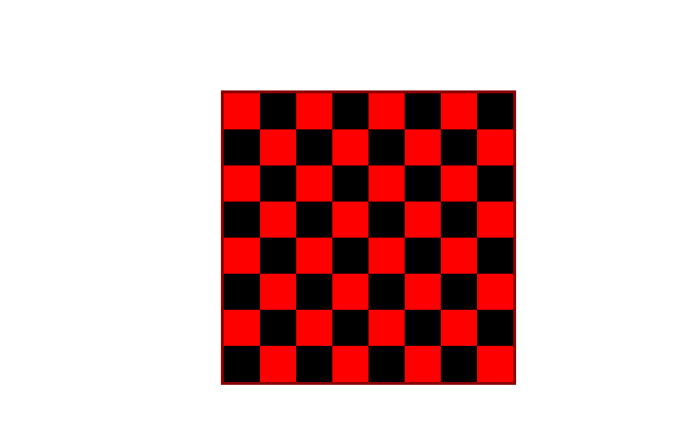

# ♟️ Checkerboard Generator

## Preview



## Run the app

```
python app.py
```

Then open your browser at: `http://127.0.0.1:5000`

## Built With

- [Flask](https://flask.palletsprojects.com/) — Python web framework
- [Jinja2](https://jinja.palletsprojects.com/) — HTML templating engine

## Features

- Generate a checkerboard via URL parameters: `/<x>/<y>/<color1>/<color2>`
- Defaults to 8x8 red & black if no parameters are provided
- Both `x` and `y` must be divisible by 4, otherwise an error is shown