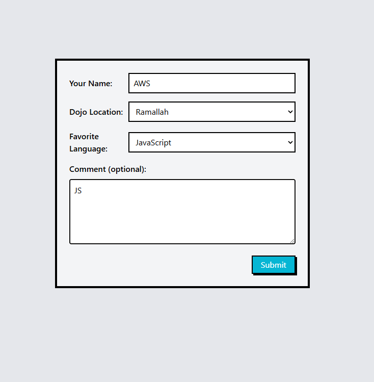
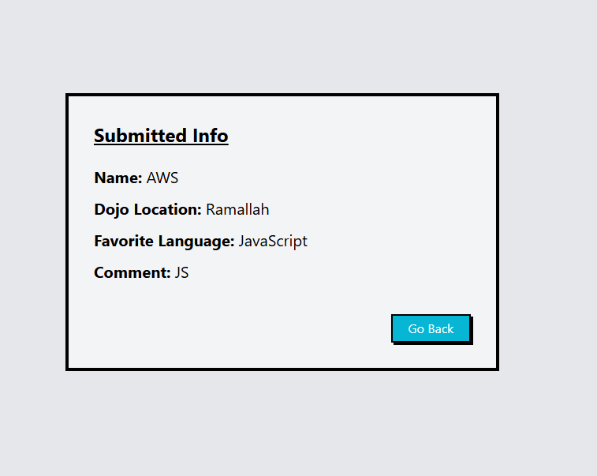

# Dojo Survey

## Preview

**Survey Form**



**Submitted Result**



## Run the app

```
python server.py
```

Then open your browser at: `http://127.0.0.1:5000`

## Built With

- [Flask](https://flask.palletsprojects.com/) — Python web framework
- [Jinja2](https://jinja.palletsprojects.com/) — HTML templating engine
- [Tailwind CSS](https://tailwindcss.com/) — Utility-first CSS framework (via CDN)

## Features

- User fills out a survey: Name, Dojo Location, Favorite Language, and Comment
- Submitted data appears on a result page
- Go Back button returns to the form