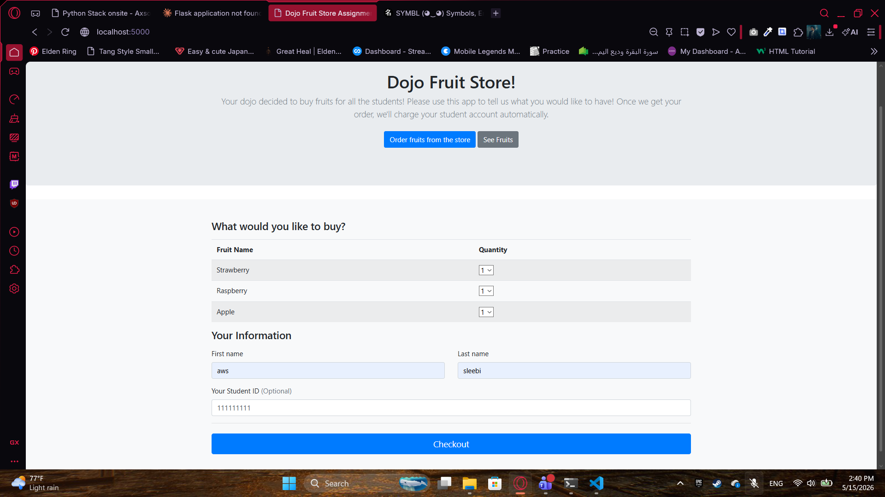
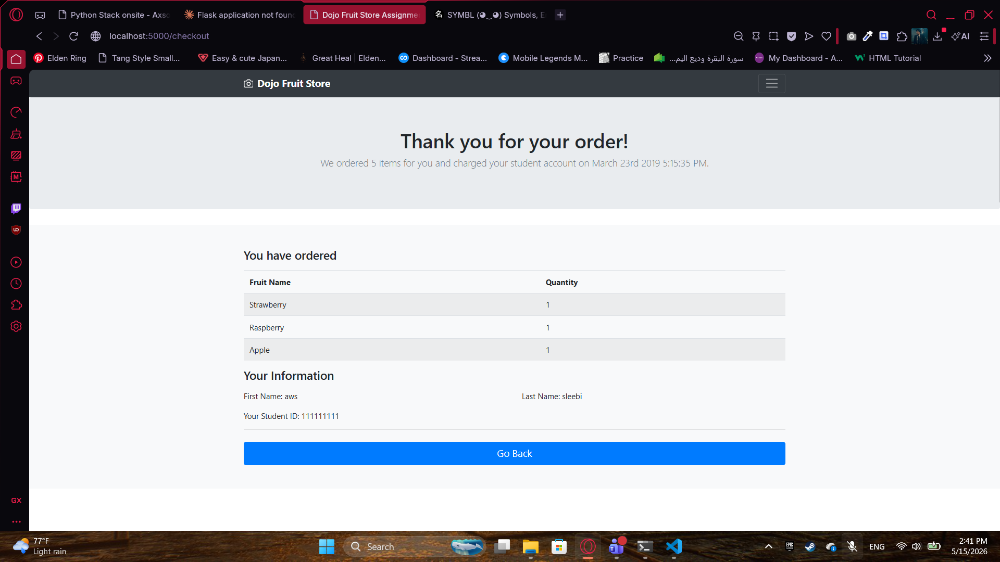

# Dojo Fruit Store

## Preview

**Order Page** `/`



**Checkout Page** `/checkout`



## Run the app

```
python server.py
```

Then open your browser at: `http://127.0.0.1:5000`

## Built With

- [Flask](https://flask.palletsprojects.com/) — Python web framework
- [Jinja2](https://jinja.palletsprojects.com/) — HTML templating engine
- [Tailwind CSS](https://tailwindcss.com/) — Utility-first CSS framework (via CDN)

## Features

- Browse available fruits on the order page with quantity selectors
- Fill in First Name, Last Name, and Student ID then click Checkout
- Checkout page displays ordered fruits, quantities, and customer info
- Terminal prints: `Charging <name> for <count> fruits :- `

ImmutableMultiDict([('strawberry', '1'), ('raspberry', '1'), ('apple', '1'), ('first_name', 'aws'), ('last_name', 'sleebi'), ('student_id', '111111111')])
charging awssleebi for 3 fruits.

- Refreshing the checkout page re-submits the POST — terminal prints again and form data persists, demonstrating why PRG pattern matters