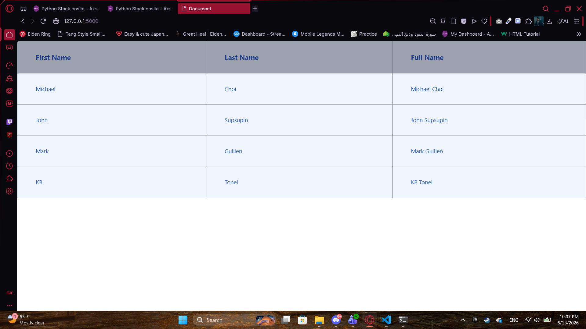

# Flask + Tailwind CSS User Table

A simple Flask web app that displays a list of users in a styled HTML table using Tailwind CSS.

##  Preview

### Run the app

python app.py

Then open your browser at: `http://127.0.0.1:5000`

##  Built With

- [Flask](https://flask.palletsprojects.com/) — Python web framework
- [Tailwind CSS](https://tailwindcss.com/) — Utility-first CSS framework (via CDN)

##  Features

- Displays users in a clean responsive table
- Full Name is generated automatically from First + Last name
- Styled with Tailwind CSS