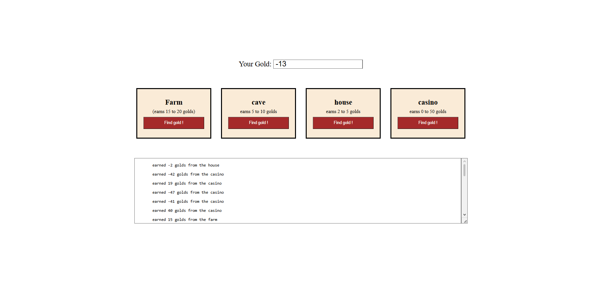

# Ninja Gold

## Preview



## Run the app

```
python server.py
```

Then open your browser at: `http://127.0.0.1:5000`

## Built With

- [Flask](https://flask.palletsprojects.com/) — Python web framework
- [Jinja2](https://jinja.palletsprojects.com/) — HTML templating engine

## Features

- Choose a location to search for gold: Farm, Cave, House, or Casino
- Each location has a different gold range and can earn or lose gold
- Total gold updates after every search and persists across visits via session
- A scrollable log shows the history of all earned and lost gold amounts