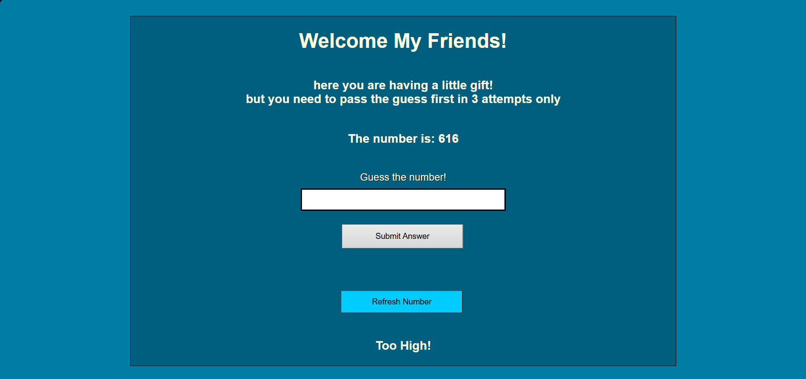

# Guess The Number

## Preview



## Run the app

```
python server.py
```

Then open your browser at: `http://127.0.0.1:5000`

## Built With

- [Flask](https://flask.palletsprojects.com/) — Python web framework
- [Jinja2](https://jinja.palletsprojects.com/) — HTML templating engine

## Features

- A random number between 1 and 1000 is generated on start
- Player has 3 attempts to guess the correct number
- Feedback after each guess: Correct, Too High, Too Low, or Close (within 10)
- Refresh Number button generates a new random number anytime