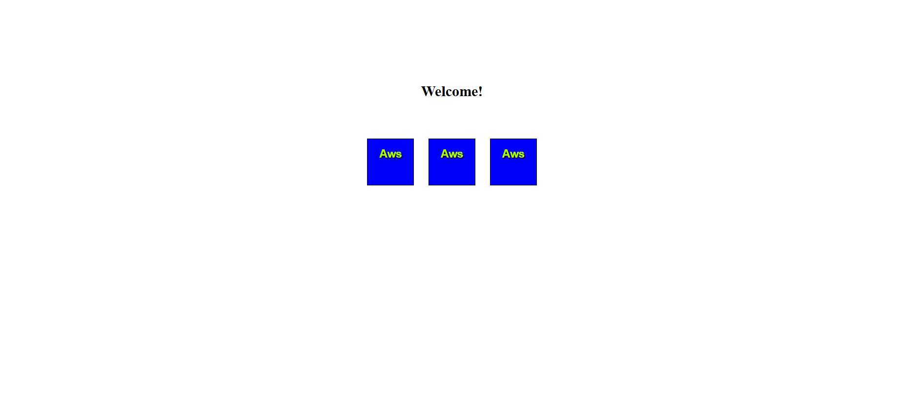
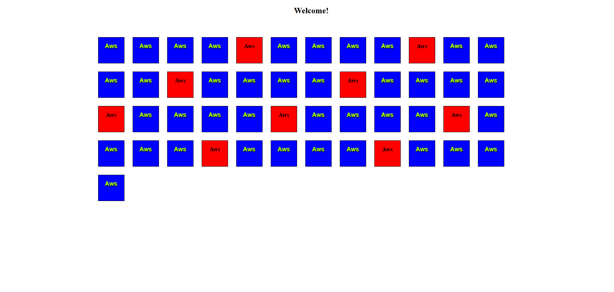

# Aws Grid

## Preview

**Default route** `/play/`



**With parameters** `/play/50/blue`



## Run the app

```
python app.py
```

Then open your browser at: `http://127.0.0.1:5000`

## Built With

- [Flask](https://flask.palletsprojects.com/) — Python web framework
- [Jinja2](https://jinja.palletsprojects.com/) — HTML templating engine

## Features

- Generate a grid of tiles via URL: `/play/<x>/<color>`
- Defaults to 4 blue tiles if no parameters are provided
- Every 5th tile is always highlighted in red