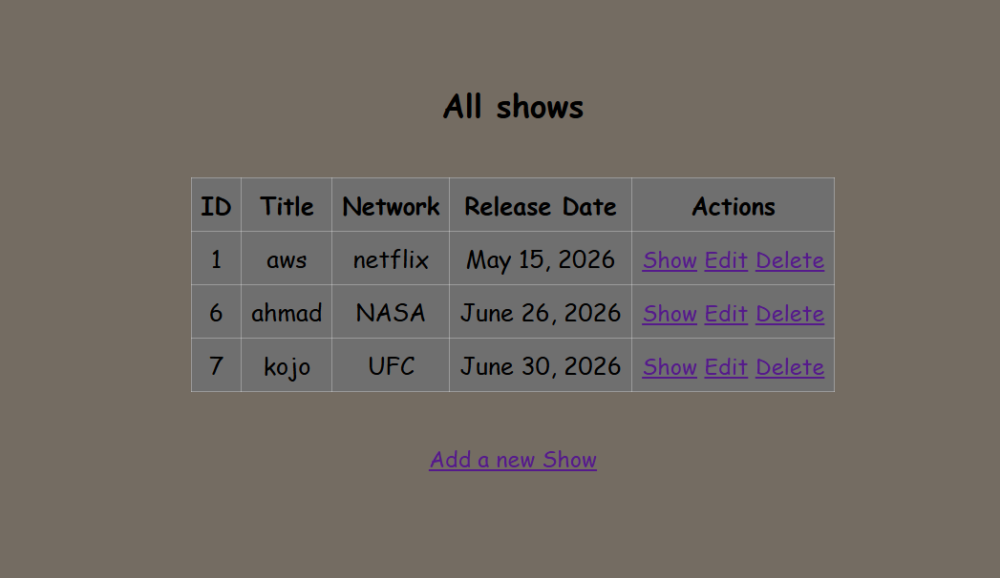
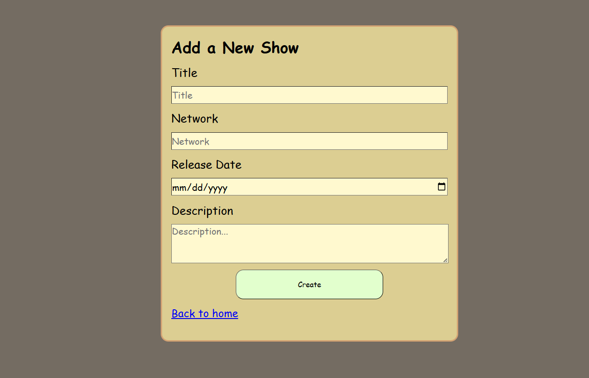
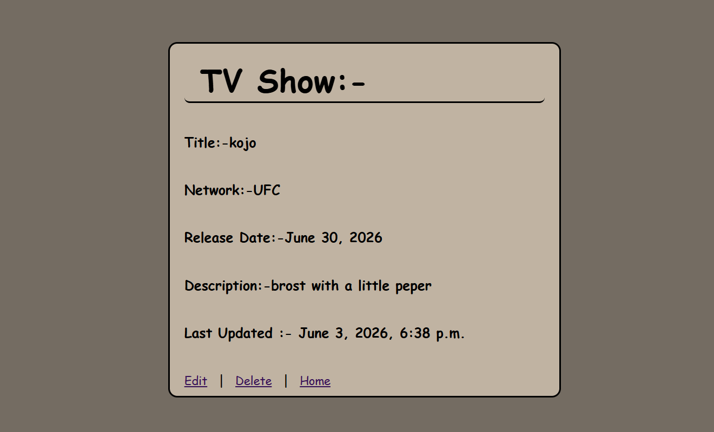
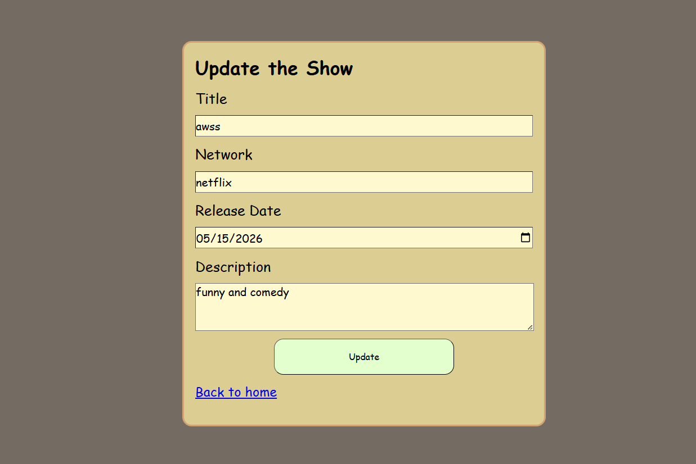

# TV Shows — Full CRUD

## Preview

**All Shows** `/`



**Add a Show** `/gotoaddshow/`



**Show Details** `/tvshow/<id>`



**Edit a Show** `/editshow/<id>`



## Run the app

```
# 1. create virtual environment
python -m venv venv

# 2. activate it
call djangoPy3Env\Scripts\activate

# 3. create the project
django-admin startproject tvshows

# 4. create the app
python manage.py startapp shows_app

# 5. run migrations
python manage.py makemigrations
python manage.py migrate

# 6. run the server
python manage.py runserver
```

Then open your browser at: `http://127.0.0.1:8000`

## Built With

- [Django](https://www.djangoproject.com/) — Python web framework
- [Jinja2](https://jinja.palletsprojects.com/) — HTML templating engine

## Features

- `/` — displays all shows in a table with ID, Title, Network, Release Date, and Actions
- `/gotoaddshow/` — displays the form to add a new show
- `/addshow/` — handles POST and saves the new show then redirects to `/`
- `/tvshow/<id>` — displays full details of a single show including last updated time
- `/editshow/<id>` — displays the edit form pre-filled with show data
- `/delete/<id>` — deletes the show and redirects to `/`