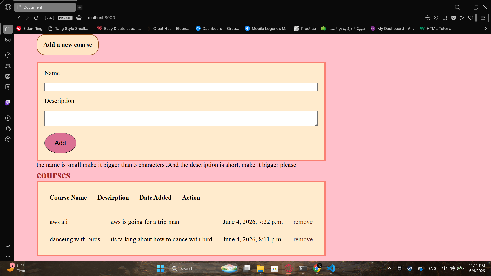
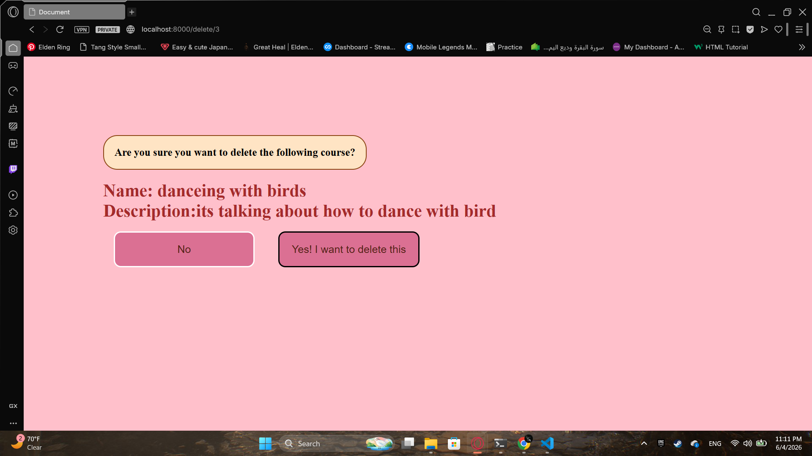

# Courses — Validation & Delete Confirmation

## Preview

**Main Page** `/`



**Delete Confirmation** `/delete/<id>`



## Run the app

```
# 1. create virtual environment
python -m venv venv

# 2. activate it
call djangoPy3Env\Scripts\activate

# 3. create the project
django-admin startproject coursesproject

# 4. create the app
python manage.py startapp courses_app

# 5. run migrations
python manage.py makemigrations
python manage.py migrate

# 6. run the server
python manage.py runserver
```

Then open your browser at: `http://127.0.0.1:8000`

## Built With

- [Django](https://www.djangoproject.com/) — Python web framework
- [Jinja2](https://jinja.palletsprojects.com/) — HTML templating engine

## Features

- `/` — displays the add course form and a table of all courses with name, description, date added, and a remove link
- Form validation — name must be more than 5 characters, description must be more than 15 characters
- Error messages shown inline when validation fails
- `/delete/<id>` — confirmation page showing course details before deleting
- `/remove/<id>` — deletes the course and redirects to `/`