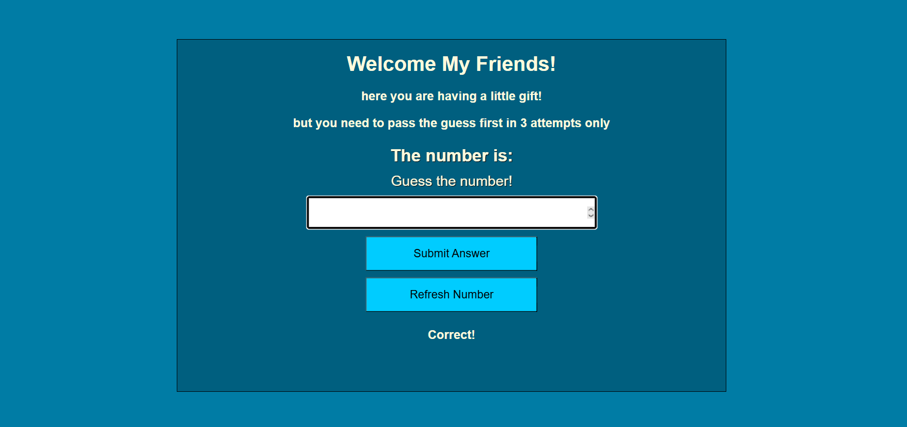

# Django Guess The Number

## Preview



## Run the app

```
# 1. create virtual environment
python -m venv venv

# 2. activate it
call djangoPy3Env\Scripts\activate

# 3. create the project
django-admin startproject guessgame

# 4. create the app
python manage.py startapp Number_game

# 5. run the server
python manage.py runserver
```

Then open your browser at: `http://127.0.0.1:8000`

## Built With

- [Django](https://www.djangoproject.com/) — Python web framework
- [Jinja2](https://jinja.palletsprojects.com/) — HTML templating engine

## Features

- A random number between 0 and 100 is generated on start
- Player has 3 attempts to guess the correct number
- Feedback after each guess: Correct, Too High, Too Low, or Close (within 5)
- Refresh Number button generates a new random number anytime