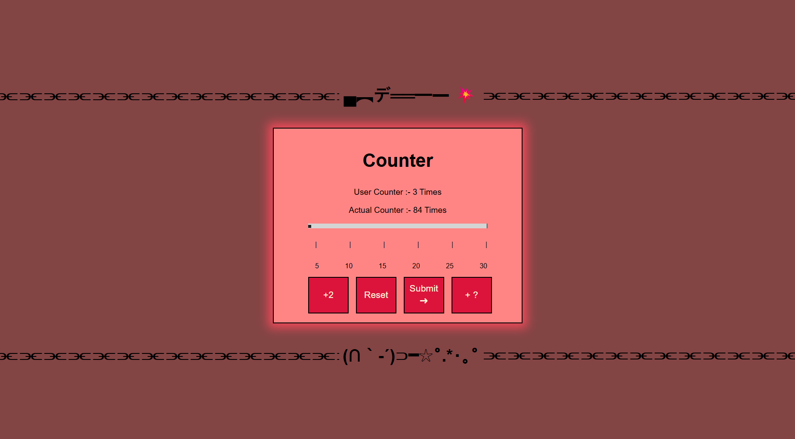

# Django Session Counter

## Preview



## Run the app

```
# 1. create virtual environment
python -m venv venv

# 2. activate it
call djangoPy3Env\Scripts\activate

# 3. create the project
django-admin startproject counterproject

# 4. create the app
python manage.py startapp the_count

# 5. run the server
python manage.py runserver
```

Then open your browser at: `http://127.0.0.1:8000`

## Built With

- [Django](https://www.djangoproject.com/) — Python web framework
- [Jinja2](https://jinja.palletsprojects.com/) — HTML templating engine

## Features

- **User Counter** — tracks manual interactions only, resets on destroy
- **Actual Counter** — tracks every page visit including refreshes, never resets
- **+2 button** — adds 2 to the user counter
- **Slider** — pick a number between 4 and 30, then hit Submit to set it
- **+N button** — adds the selected slider value to the user counter
- **Reset button** — resets the user counter only, actual counter keeps going