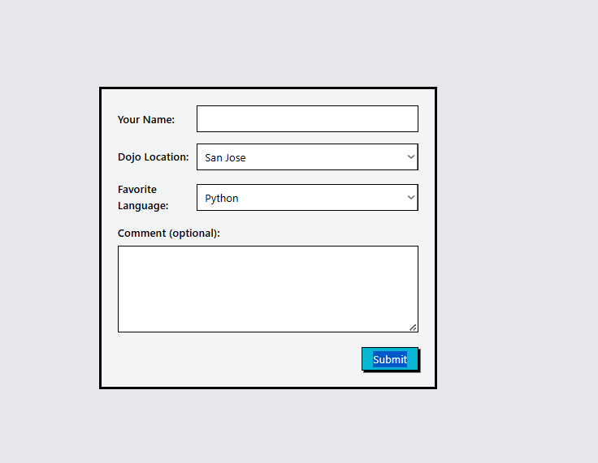
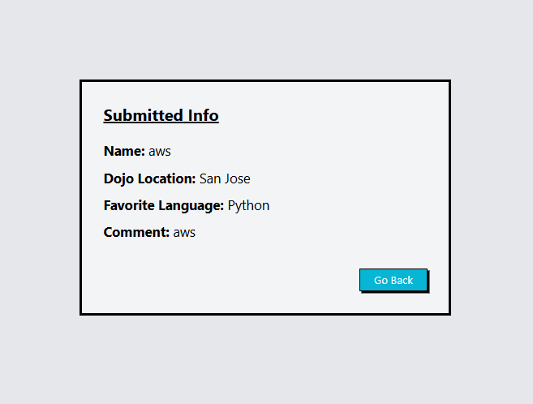

# Django Dojo Survey

## Preview

**Survey Form**



**Submitted Result**



## Run the app

```
# 1. create virtual environment
python -m venv venv

# 2. activate it

call djangoPy3Env\Scripts\activate


# 3. create the project
django-admin startproject dojosurvey

# 4. create the app
python manage.py startapp survey

# 5. run the server
python manage.py runserver
```

Then open your browser at: `http://127.0.0.1:8000`

## Built With

- [Django](https://www.djangoproject.com/) — Python web framework
- [Jinja2](https://jinja.palletsprojects.com/) — HTML templating engine

## Features

- `/` — displays the survey form
- `/result/` — handles POST and displays submitted info: Name, Dojo Location, Favorite Language, and Comment
- Go Back button returns to the form