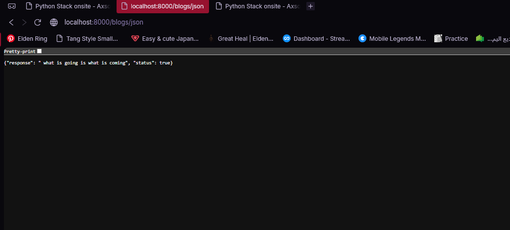

# Django Blogs

## Preview



## Run the app

```
python manage.py runserver
```

Then open your browser at: `http://127.0.0.1:8000`

## Built With

- [Django](https://www.djangoproject.com/) — Python web framework

## Features

- `/` — redirects to `/blogs`
- `/blogs` — placeholder for listing all blogs
- `/blogs/new` — placeholder for displaying a form to create a new blog
- `/blogs/create` — redirects to `/` after creating a blog
- `/blogs/<id>` — placeholder for displaying a single blog by ID
- `/blogs/<id>/edit` — placeholder for displaying an edit form for a blog
- `/blogs/<id>/destroy` — redirects to `/` after deleting a blog
- `/aws` — returns a JSON response with a custom message and status