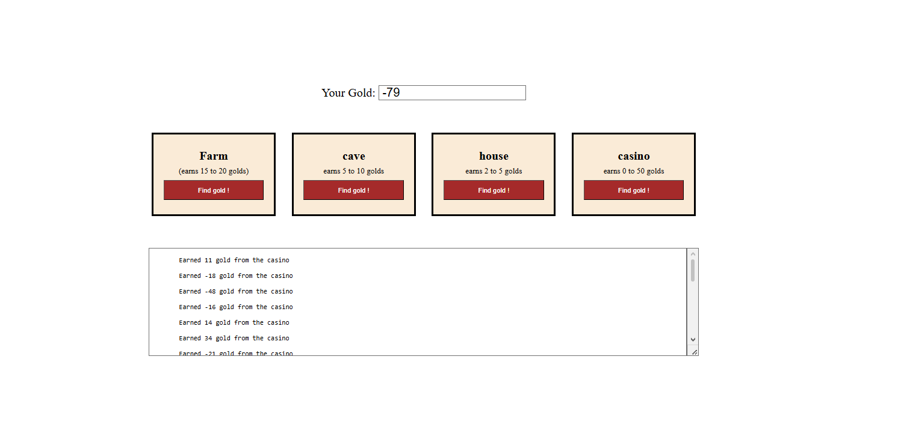

# Django Ninja Gold

## Preview



## Run the app

```
# 1. create virtual environment
python -m venv venv

# 2. activate it
call djangoPy3Env\Scripts\activate

# 3. create the project
django-admin startproject ninjagold

# 4. create the app
python manage.py startapp ninja

# 5. run the server
python manage.py runserver
```

Then open your browser at: `http://127.0.0.1:8000`

## Built With

- [Django](https://www.djangoproject.com/) — Python web framework
- [Jinja2](https://jinja.palletsprojects.com/) — HTML templating engine

## Features

- Choose a location to search for gold: Farm, Cave, House, or Casino
- Each location has a different gold range and can earn or lose gold
- Total gold updates after every search and persists across visits via session
- A scrollable log shows the history of all earned and lost gold amounts