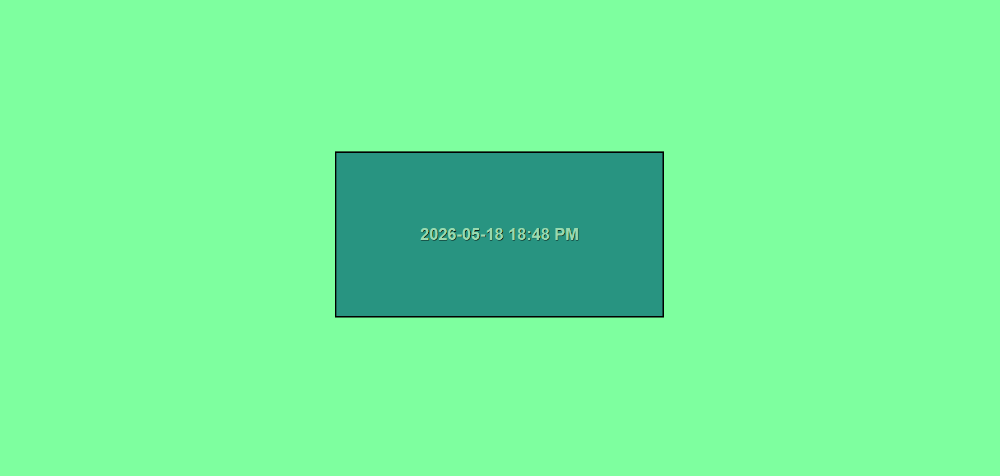

# Time Display

## Preview



## Run the app

```
python manage.py runserver
```

Then open your browser at: `http://127.0.0.1:8000`

## Built With

- [Django](https://www.djangoproject.com/) — Python web framework
- [Jinja2](https://jinja.palletsprojects.com/) — HTML templating engine

## Features

- `/` — displays the current UTC time in `YYYY-MM-DD HH:MM AM/PM` format