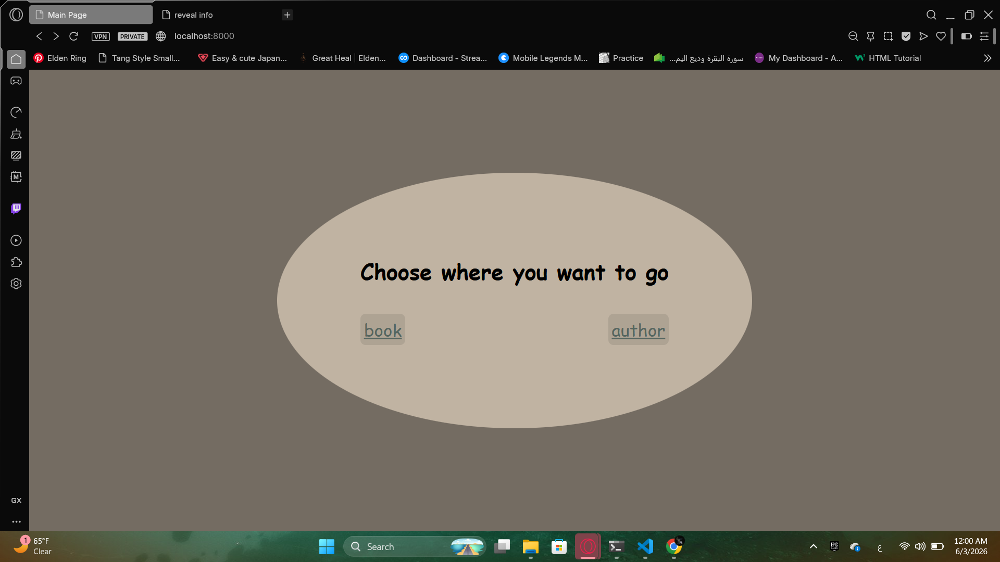
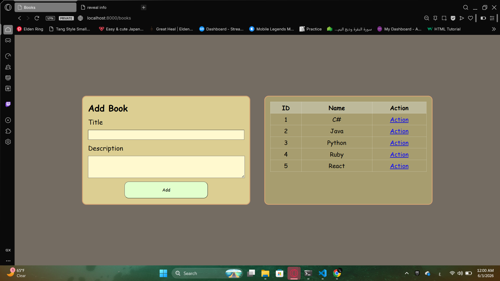
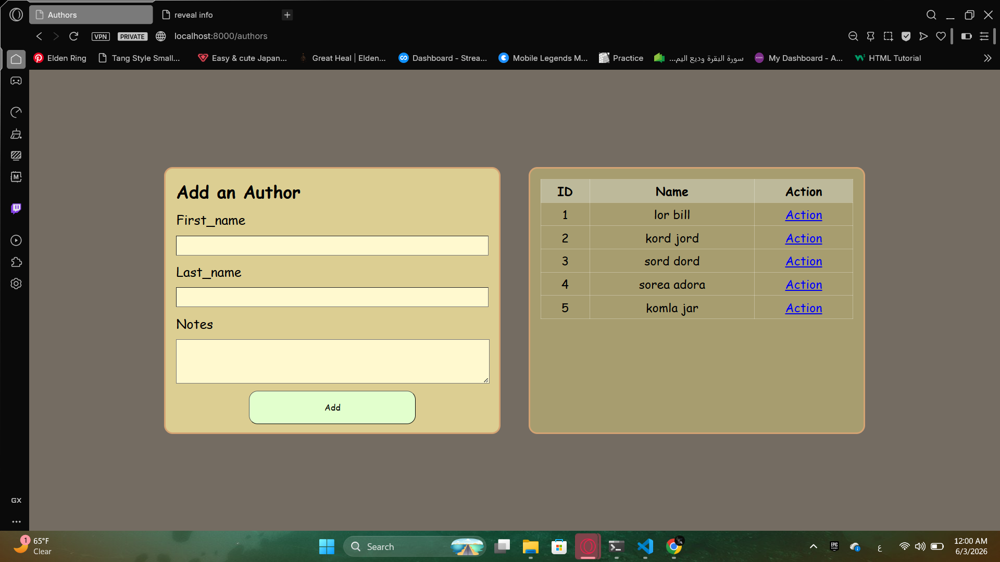
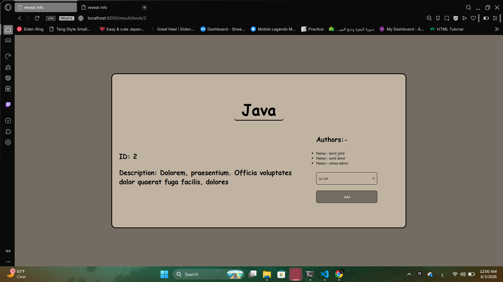
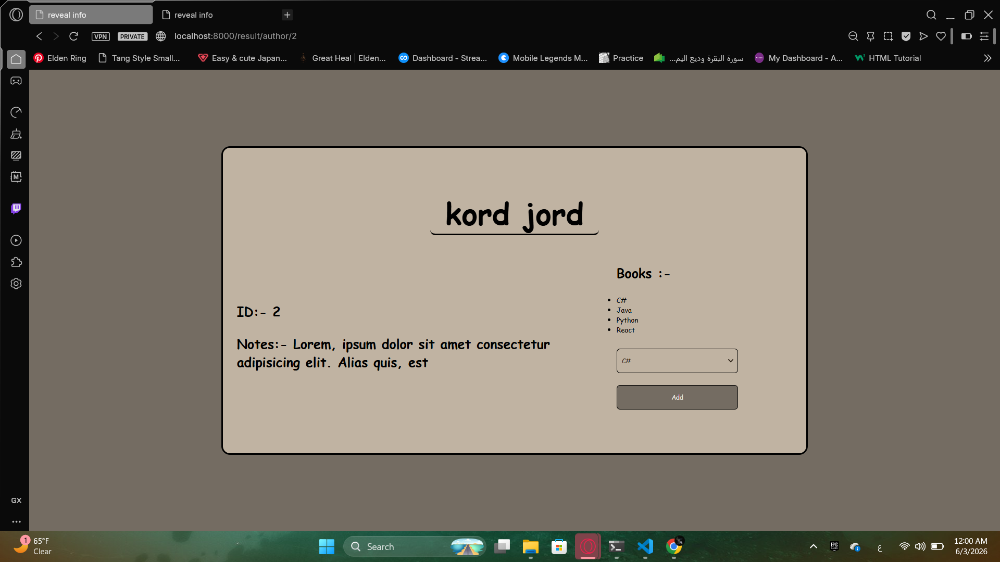

# Books & Authors

## Preview

### Home Page


### Books Page


### Authors Page


### Result - Book Detail


### Result - Author Detail


## Run the app

```
# 1. create virtual environment
python -m venv venv

# 2. activate it
call venv\Scripts\activate

# 3. create the project
django-admin startproject books_project

# 4. create the app
python manage.py startapp books_app

# 5. run migrations
python manage.py makemigrations
python manage.py migrate

# 6. run the server
python manage.py runserver
```

Then open your browser at: `http://127.0.0.1:8000`

## Built With

- [Django](https://www.djangoproject.com/) — Python web framework
- [Jinja2](https://jinja.palletsprojects.com/) — HTML templating engine

## Features

- Add a Book with title and description
- Add an Author with first name, last name, and notes
- Display all books and all authors
- View a book's detail page and assign authors to it
- View an author's detail page and assign books to them
- Many-to-many relationship between Books and Authors