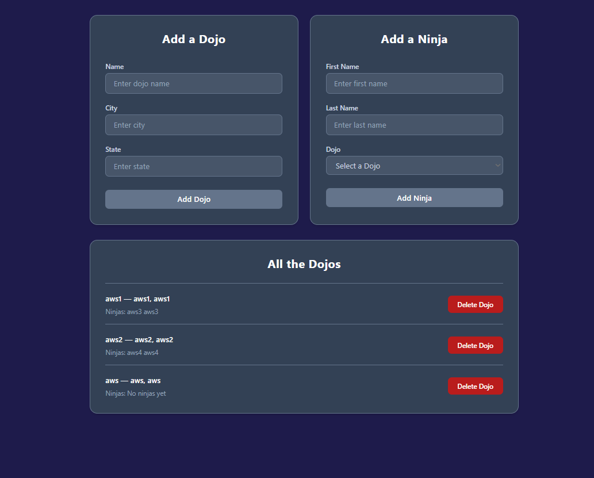

# Dojo & Ninja

## Preview



## Run the app

```
# 1. create virtual environment
python -m venv venv

# 2. activate it
call djangoPy3Env\Scripts\activate

# 3. create the project
django-admin startproject dojoninja

# 4. create the app
python manage.py startapp ninja_app

# 5. run migrations
python manage.py makemigrations
python manage.py migrate

# 6. run the server
python manage.py runserver
```

Then open your browser at: `http://127.0.0.1:8000`

## Built With

- [Django](https://www.djangoproject.com/) — Python web framework
- [Jinja2](https://jinja.palletsprojects.com/) — HTML templating engine
- [Tailwind CSS](https://tailwindcss.com/) — Utility-first CSS framework (via CDN)

## Features

- Add a Dojo with name, city, and state
- Add a Ninja with first name, last name, and assign them to an existing dojo
- Display all dojos with their ninjas listed under each one
- Delete a dojo and all its ninjas