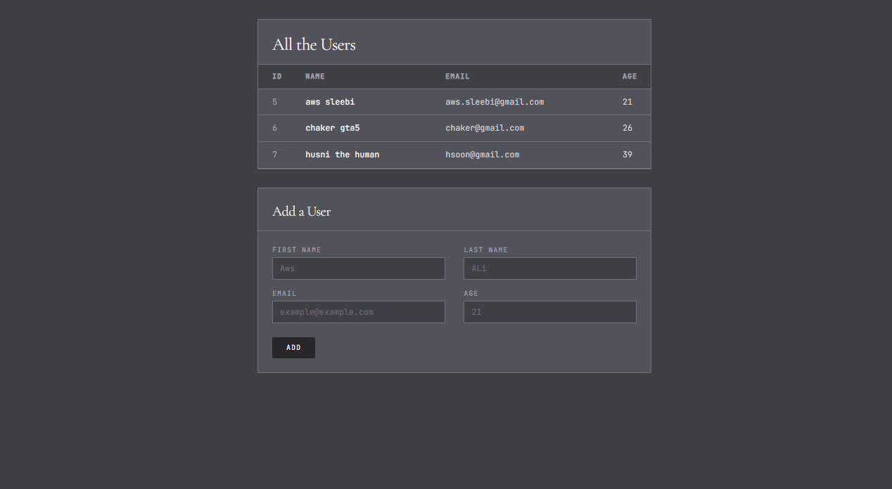

# Users With Templates

## Preview



## Run the app

```
# 1. create virtual environment
python -m venv venv

# 2. activate it
call djangoPy3Env\Scripts\activate

# 3. create the project
django-admin startproject usersproject

# 4. create the app
python manage.py startapp users_app

# 5. run migrations
python manage.py makemigrations
python manage.py migrate

# 6. run the server
python manage.py runserver
```

Then open your browser at: `http://127.0.0.1:8000`

## Built With

- [Django](https://www.djangoproject.com/) — Python web framework
- [Jinja2](https://jinja.palletsprojects.com/) — HTML templating engine
- [Tailwind CSS](https://tailwindcss.com/) — Utility-first CSS framework (via CDN)

## Features

- `/` — displays all users in a table with ID, Name, Email, and Age
- `/result` — handles POST form submission and saves a new user to the database then redirects to `/`